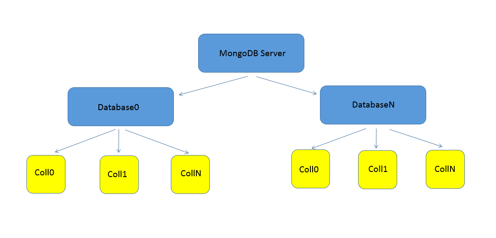

# Getting Started With MongoDB Queries

## Objectives

By the end of this module you will know how to:

- Install, setup and run MongoDB on your local machine
- Load bulk data from a text file into MongoDB using mongoimport
- Use the Interactive Shell to run basic queries using [query documents](http://docs.mongodb.org/manual/tutorial/query-documents/)
- Use operators such as $gt and $or for queries and [projections](http://docs.mongodb.org/manual/tutorial/query-documents/).

## Getting Started

The first thing you need to do is [install mongodb](http://docs.mongodb.org/manual/installation/) for your specific system. Follow the instructions for mongodb for your operating system.

You should setup mongodb such that you have it installed in an easy to access directory such as 

```bash
# linux/unix
/mongodb
# windows
C:\mongodb
```

Now that you have MongoDB installed you need to create a data directory for it to store data to the disk. Execute the following commands from your **bin** folder in your mongodb installation:

```bash
mkdir /data/db
```
Now that we have our data directory you can run the mongodb database process 

**mongod**:

```bash
mongod
```

This starts up the MongoDB server and indicates we can start inserting data.

## MongoDB Database Organization

Similar to other database systems, Mongodb data organization starts with the database server (the **mongod** process). Each server may have N number of databases and within each database there are N number of [collections](http://docs.mongodb.org/manual/reference/glossary/#term-collection). 



This structure allows for more advance scaling such as [sharding](http://docs.mongodb.org/manual/sharding/) to provide more throughput and [replicase sets](http://docs.mongodb.org/manual/core/replication/) for better redundancy.

## Loading up test data into mongodb

Within the data directory of this repository there is a **bank_data.json.zip** file; you should decompress it. We will use this file to load up the bank data collection into mongodb. From the mongodb installation **bin** in a new console window, execute the command:

```bash
mongoimport <path to bank_data.json> --jsonArray --collection bank_data
```
The command will actually load up the json data in the file up into a collection called 'bank_data' in your default MongoDB database on your mongodb server. This may take a while however you'll be able to keep track of the percentage:

```bash
Users-Computer-4:bin user$ ./mongoimport /Users/user/Documents/crimeDataConvert/data/bank_data.json --jsonArray --collection bank_data
connected to: 127.0.0.1
2014-11-16T02:11:10.797-0800 		Progress: 192824/22758676	0%
2014-11-16T02:11:10.797-0800 			400	133/second
2014-11-16T02:11:13.316-0800 		Progress: 340537/22758676	1%
2014-11-16T02:11:13.316-0800 			700	116/second
2014-11-16T02:11:16.648-0800 		Progress: 533438/22758676	2%
2014-11-16T02:11:16.648-0800 			1100	122/second
```

After all of this 50,000 documents will be uploaded into your local MongoDB server. Although that may sound like a lot, its likely a manageable size to work with on your computer.

Now that all your bank accounts data has been loaded up into MongoDB we are ready to start exploring!

## The MongoDB Interactive Shell

MongoDB has an interactive shell which is very similar to the javascript interactive shell except it includes a mongodb api. Most commands are actually javascript however are slightly different than the Node.js javascript version we will work with in [module 3](../module3_language_drivers/README.md). To run the shell execute the following command from your mongodb installation **bin** folder:

```bash
mongo
```

This will automatically connect you to your local mongodb server running in your other console window.

If you ever want to explore anything outside of this guide in the interactive shell, you can get more info by doing:

```bash
help
```

The remainder of this module will use the MongoDB Interactive Shell to explore MongoDB capabilities. [Module 3](../module3_language_drivers/README.md) will focus on the [C#] (http://docs.mongodb.org/ecosystem/drivers/csharp/)and [Node.js](http://docs.mongodb.org/ecosystem/drivers/node-js/) language drivers.

### Collections

Collections in in MongoDB are containers for a group of similar entities. In our example from module1 the **Person** entity was the root entity. A single database can have many collections. To display the collections in your database execute:

```
# shows collections in database
show collections
```

The output of your command will look similar to:

```bash
> show collections
bank_data
system.indexes

```

To get the collection object, we can use the **db** reference to the current database.

```bash
db.bank_data
```
To see how many documents we loaded into the mongodb collection we can use the **count()** function on the collection object:

```bash
> db.bank_data.count()
50000
```

There's much more you can do with a collection. Checkout the collections help by doing:

```bash
db.bank_data.help()
```

### Queries

Now that we have bulk data loaded up we can make some queries across the Person collection. All queries in MongoDB use the **find** function on the query to get specific documents from the collection. Let's try our first query with the .findOne method which finds the first document in the collection.

```js
db.bank_data.findOne()
```

This command should return something similar to:

```json
{
	"_id" : ObjectId("5468782fca357ca95f2f4b88"),
	"first_name" : "JAMES",
	"last_name" : "SMITH",
	"accounts" : [
		{
			"account_type" : "Investment",
			"account_balance" : 6144974.110823463,
			"currency" : "YEN"
		},
		{
			"account_type" : "Savings",
			"account_balance" : 1329372.569229168,
			"currency" : "EURO"
		}
	]
}
```

Like our example from [module 1](../module1_intro_doc_dbs/README.md) we get a Person document with a number of Account sub documents within it. This query didn't really have anything interesting to it. We simply wanted to retrieve the first person in Person collection (that is what MongoDB interpreted when we didn't specify any parameters into the *findOne()* function).

Let's see what happens when you execute:

```js
db.collection.find()
```

You'll actually get a ton of text similar to:

```json

{ "_id" : ObjectId("5468782fca357ca95f2f4b88"), "first_name" : "JAMES", "last_name" : "SMITH", "accounts" : [ { "account_type" : "Investment", "account_balance" : 6144974.110823463, "currency" : "YEN" }, { "account_type" : "Savings", "account_balance" : 1329372.569229168, "currency" : "EURO" } ] }
{ "_id" : ObjectId("54687830ca357ca95f2f4b89"), "first_name" : "JAMES", "last_name" : "JOHNSON", "accounts" : [ { "account_type" : "Investment", "account_balance" : 9840052.941285312, "currency" : "POUNDS STERLING" }, { "account_type" : "401K", "account_balance" : 5588991.2251258055, "currency" : "PESO" }, { "account_type" : "Savings", "account_balance" : 4235557.4669413585, "currency" : "POUNDS STERLING" }, { "account_type" : "Savings", "account_balance" : 8799224.831341146, "currency" : "YEN" }, { "account_type" : "401K", "account_balance" : 5962745.686764822, "currency" : "USD" }, { "account_type" : "Savings", "account_balance" : 9818556.57020622, "currency" : "POUNDS STERLING" }, { "account_type" : "Investment", "account_balance" : 6418584.010852241, "currency" : "EURO" } ] }
{ "_id" : ObjectId("54687830ca357ca95f2f4b8a"), "first_name" : "JAMES", "last_name" : "WILLIAMS", "accounts" : [ { "account_type" : "Investment", "account_balance" : 4904214.484536952, "currency" : "YEN" }, { "account_type" : "Savings", "account_balance" : 8618841.25467285, "currency" : "YUAN" }, { "account_type" : "Investment", "account_balance" : 913765.1830773808, "currency" : "YUAN" }, { "account_type" : "Checking", "account_balance" : 1376331.8743719491, "currency" : "PESO" }, { "account_type" : "Investment", "account_balance" : 7871363.623830194, "currency" : "PESO" }, { "account_type" : "Checking", "account_balance" : 6203323.441020354, "currency" : "YUAN" }, { "account_type" : "Investment", "account_balance" : 917203.6349922416, "currency" : "USD" }, { "account_type" : "401K", "account_balance" : 5979093.451052592, "currency" : "PESO" } ] }
{ "_id" : ObjectId("54687830ca357ca95f2f4b8b"), "first_name" : "JAMES", "last_name" : "BROWN", "accounts" : [ { "account_type" : "Checking", "account_balance" : 5155.384490680648, "currency" : "EURO" } ] }
{ "_id" : ObjectId("54687830ca357ca95f2f4b8c"), "first_name" : "JAMES", "last_name" : "JONES", "accounts" : [ { "account_type" : "Savings", "account_balance" : 1871922.5181302335, "currency" : "POUNDS STERLING" }, { "account_type" : "401K", "account_balance" : 2454099.221148599, "currency" : "YUAN" }, { "account_type" : "Checking", "account_balance" : 8873605.096902523, "currency" : "PESO" }, { "account_type" : "Checking", "account_balance" : 7345421.697284348, "currency" : "POUNDS STERLING" }, { "account_type" : "Savings", "account_balance" : 6429599.448691073, "currency" : "EURO" }, { "account_type" : "Savings", "account_balance" : 6569446.0432147905, "currency" : "YUAN" }, { "account_type" : "401K", "account_balance" : 2952708.430080968, "currency" : "EURO" } ] }
{ "_id" : ObjectId("54687830ca357ca95f2f4b8d"), "first_name" : "JAMES", "last_name" : "MILLER", "accounts" : [ { "account_type" : "Checking", "account_balance" : 5000794.5164514, "currency" : "EURO" } ] }
{ "_id" : ObjectId("54687830ca357ca95f2f4b8e"), "first_name" : "JAMES", "last_name" : "DAVIS", "accounts" : [ { "account_type" : "401K", "account_balance" : 1634239.7192724317, "currency" : "EURO" }, { "account_type" : "Checking", "account_balance" : 5123875.592675053, "currency" : "YEN" }, { "account_type" : "Investment", "account_balance" : 9652688.997844521, "currency" : "PESO" }, { "account_type" : "401K", "account_balance" : 436608.31229717913, "currency" : "YUAN" } ] }
{ "_id" : ObjectId("54687830ca357ca95f2f4b8f"), "first_name" : "JAMES", "last_name" : "GARCIA", "accounts" : [ { "account_type" : "Investment", "account_balance" : 3928991.3192649623, "currency" : "YUAN" }, { "account_type" : "Checking", "account_balance" : 4061586.788287755, "currency" : "YUAN" }, { "account_type" : "Investment", "account_balance" : 3907978.032141935, "currency" : "POUNDS STERLING" }, { "account_type" : "Checking", "account_balance" : 7980062.845765791, "currency" : "EURO" }, { "account_type" : "Investment", "account_balance" : 5629389.621828526, "currency" : "USD" }, { "account_type" : "Savings", "account_balance" : 2822423.1437263936, "currency" : "PESO" }, { "account_type" : "401K", "account_balance" : 5603218.9455431765, "currency" : "EURO" } ] }
```

You'll see the ```Type "it" for more``` prompt because the **find()** method called without any parameters retrieves ALL documents in the collection. Since you have so many documents in the collection MongoDB will give us a [cursor](http://en.wikipedia.org/wiki/Cursor_(databases)) which will allow us to iterate through the results in a more manageable fashion.

We can always do a **count()** over the results to see how many documents were retrieved as a result of the query. For example:

```js
db.bank_data.find().count()
```
Will return the number of documents in the collection since *find()* has no parameters:

```json
50000
```


Let's look at some of basic queries and those with **AND**, **OR**, **Greater Than/Less Than/NotEqual**:

### Basic Queries with Filters

The **find** function takes sort of an object projection to return the desired set of documents. For example, to return all Person documents with the last name = "Smith" we can do:

```js
db.bank_data.find({last_name : "SMITH"}).count()
```

And we'll see how many people exist in the database with the last name, SMITH:

```
100
```

We can pick out a record to display by selecting a number on the collection between 0 and 100 for this example:

```js
db.bank_data.find({last_name : "SMITH"})[12]
```
	
This will return the 13th record in the result:

```json
{
	"_id" : ObjectId("546960b6ca357ca95f301689"),
	"first_name" : "CHRISTOPHER",
	"last_name" : "SMITH",
	"accounts" : [
		{
			"account_type" : "Savings",
			"account_balance" : 1870338.5807330757,
			"currency" : "POUNDS STERLING"
		},
		{
			"account_type" : "Checking",
			"account_balance" : 5098043.412530517,
			"currency" : "POUNDS STERLING"
		},
		{
			"account_type" : "Checking",
			"account_balance" : 3042158.5783834355,
			"currency" : "YEN"
		},
		{
			"account_type" : "Investment",
			"account_balance" : 2721431.0181220435,
			"currency" : "PESO"
		},
		{
			"account_type" : "Savings",
			"account_balance" : 2135388.570106006,
			"currency" : "USD"
		},
		{
			"account_type" : "Savings",
			"account_balance" : 2416831.8654360515,
			"currency" : "PESO"
		},
		{
			"account_type" : "Savings",
			"account_balance" : 405349.36727577704,
			"currency" : "POUNDS STERLING"
		},
		{
			"account_type" : "Investment",
			"account_balance" : 6140519.315997784,
			"currency" : "YEN"
		}
	]
}

```

Notice how we retrieved all the accounts as well, even though we only specified the persons last name. This is because when we query we are querying for documents and therefore any associated information is also retrieved.

It's possible to omit the associated information by specifying a second [projection](http://docs.mongodb.org/manual/reference/operator/projection/positional/) object to the *find()* function:

```js
db.bank_data.find({last_name : "SMITH"}, {first_name : 1, last_name: 1})[12]
```

```json
{
	"_id" : ObjectId("546960b6ca357ca95f301689"),
	"first_name" : "CHRISTOPHER",
	"last_name" : "SMITH"
}
```

Notice how the output above omits all the accounts for CHRISTOPHER SMITH.

We can also output the names of each person who came in the result set pretty easily by iterating through the result collection by saving it to a variable

```js
var smithPersons = db.bank_data.find({last_name : "SMITH"}, {first_name : 1, last_name: 1});
for(var i = 0; i < smithPersons.count(); i++){ 
	print(smithPersons[i].first_name + ' ' + smithPersons[i].last_name );
}
```
You'll see a long list of output similar to the following:

```
JAMES SMITH
JOHN SMITH
ROBERT SMITH
MICHAEL SMITH
WILLIAM SMITH
DAVID SMITH
...
```
### AND & OR Queries

#### AND Queries

We can achieve an AND query by simply specifying another field in the project object we pass to the *find()* function. Say that we want to get everyone in the database whose last name is SMITH and first name is JAMES:
	
```js
db.bank_data.find({last_name: "SMITH", first_name: "JAMES"})
```

We should just get one result if you haven't modified the test data (you can get the pretty JSON formatting by just doing ''[0]" on the collection):

```json
{
	"_id" : ObjectId("546960b6ca357ca95f30167f"),
	"first_name" : "JAMES",
	"last_name" : "SMITH",
	"accounts" : [
		{
			"account_type" : "Savings",
			"account_balance" : 8995952.153640702,
			"currency" : "PESO"
		},
		{
			"account_type" : "Checking",
			"account_balance" : 3901436.5580737568,
			"currency" : "USD"
		}
	]
}
```

We can also specify these constraints on embedded collections.

First, let's look for all Persons whose last name is SMITH  *and* have a Savings account:

```js
//we know that we have more than 12 elements in the resulting collection
db.bank_data.find({last_name: "SMITH", "accounts.account_type": "Savings" })[12]
```
```json
{
	"_id" : ObjectId("546960b6ca357ca95f301691"),
	"first_name" : "EDWARD",
	"last_name" : "SMITH",
	"accounts" : [
		{
			"account_type" : "401K",
			"account_balance" : 6577381.434625924,
			"currency" : "YEN"
		},
		{
			"account_type" : "Checking",
			"account_balance" : 8998935.759297138,
			"currency" : "USD"
		},
		{
			"account_type" : "Investment",
			"account_balance" : 588000.4045217587,
			"currency" : "YUAN"
		},
		{
			// This is the embedded document that matched the query
			"account_type" : "Savings",
			"account_balance" : 6743563.754405159,
			"currency" : "YUAN"
		},
		{
			"account_type" : "401K",
			"account_balance" : 8580650.627761671,
			"currency" : "POUNDS STERLING"
		},
		{
			"account_type" : "401K",
			"account_balance" : 7687815.685781645,
			"currency" : "YEN"
		},
		{
			"account_type" : "Checking",
			"account_balance" : 9128407.633252997,
			"currency" : "EURO"
		}
	]
}
```

Notice how we retrieve the entire ```accounts``` array even though we only were looking for the element with the ```account_type``` of Savings. The [```$elemMatch```](http://docs.mongodb.org/manual/reference/operator/projection/elemMatch/) projection operator allows us to return just the first element in an array that meets the criteria. 
	
We can use this operator by passing a second projection object which filters the information returned by MongoDB:

```js

// only get the first matching sub document in the array ''accounts'
db.bank_data.find({last_name: "SMITH", "accounts.account_type": "Savings" }, { first_name: 1, last_name: 1, accounts: { $elemMatch : { 'account_type' : 'Savings' } } } )[12]
```

This will give us something similar to:

```json
{
	"_id" : ObjectId("546d7827df1e5b91fcb57133"),
	"first_name" : "EDWARD",
	"last_name" : "SMITH",
	"accounts" : [
		{
			"account_type" : "Savings",
			"account_balance" : 6743563.754405159,
			"currency" : "YUAN"
		}
	]
}
```

In the query above we get ```first_name```, ```last_name``` and only the first matching ```account```. This is great way to limit the amount of data sent back by MongoDB which could be helpful for performance reasons.

Note since we are using the same condition for the ```accounts``` field the following query is a short hand equivalent:

```js
// only get the first matching sub document in the array ''accounts'
db.bank_data.find({last_name: "SMITH", "accounts.account_type": "Savings" }, { first_name: 1, last_name: 1, 'accounts.$': 1 } )[12]
```

#### OR Queries

OR queries are slightly different because they require us to use the **$or** operator alias, since the projection object syntax doesn't allow for us to specify it any other way.

Say that we wanted to get any person whose last name is SMITH or MARTINEZ. This query would look something like:

```js

db.bank_data.find({$or: [ { last_name: "MARTINEZ"}, {last_name: "SMITH"} ]})

```

To make your output a little cleaner, lets omit the accounts data:

```js

db.bank_data.find({$or: [ { last_name: "MARTINEZ"}, {last_name: "SMITH"} ]}, {first_name: 1, last_name: 1})

```
	
You should get a bunch of Person documents with either their last name being MARTINEZ or last name being SMITH


```json

{ "_id" : ObjectId("546960b7ca357ca95f3016cf"), "first_name" : "CARLOS", "last_name" : "SMITH" }
{ "_id" : ObjectId("546960b7ca357ca95f3016d0"), "first_name" : "RUSSELL", "last_name" : "SMITH" }
{ "_id" : ObjectId("546960b7ca357ca95f3016d1"), "first_name" : "BOBBY", "last_name" : "SMITH" }
{ "_id" : ObjectId("546960b7ca357ca95f3016d2"), "first_name" : "VICTOR", "last_name" : "SMITH" }
{ "_id" : ObjectId("546960b7ca357ca95f3016d3"), "first_name" : "MARTIN", "last_name" : "SMITH" }
{ "_id" : ObjectId("546960b7ca357ca95f3016d4"), "first_name" : "ERNEST", "last_name" : "SMITH" }
{ "_id" : ObjectId("546960b7ca357ca95f3016d5"), "first_name" : "PHILLIP", "last_name" : "SMITH" }
{ "_id" : ObjectId("546960b7ca357ca95f3016d6"), "first_name" : "TODD", "last_name" : "SMITH" }
{ "_id" : ObjectId("546960b7ca357ca95f3016d7"), "first_name" : "JESSE", "last_name" : "SMITH" }
{ "_id" : ObjectId("546960b7ca357ca95f3016d8"), "first_name" : "CRAIG", "last_name" : "SMITH" }
{ "_id" : ObjectId("546960b7ca357ca95f3016d9"), "first_name" : "ALAN", "last_name" : "SMITH" }
{ "_id" : ObjectId("546960b7ca357ca95f3016da"), "first_name" : "SHAWN", "last_name" : "SMITH" }
{ "_id" : ObjectId("546960b7ca357ca95f3016db"), "first_name" : "CLARENCE", "last_name" : "SMITH" }
{ "_id" : ObjectId("546960b7ca357ca95f3016dc"), "first_name" : "SEAN", "last_name" : "SMITH" }
{ "_id" : ObjectId("546960b7ca357ca95f3016dd"), "first_name" : "PHILIP", "last_name" : "SMITH" }
{ "_id" : ObjectId("546960b7ca357ca95f3016de"), "first_name" : "CHRIS", "last_name" : "SMITH" }
{ "_id" : ObjectId("546960b7ca357ca95f3016df"), "first_name" : "JOHNNY", "last_name" : "SMITH" }
{ "_id" : ObjectId("546960b7ca357ca95f3016e0"), "first_name" : "EARL", "last_name" : "SMITH" }
{ "_id" : ObjectId("546960b7ca357ca95f3016e1"), "first_name" : "JIMMY", "last_name" : "SMITH" }
{ "_id" : ObjectId("546960b7ca357ca95f3016e2"), "first_name" : "ANTONIO", "last_name" : "SMITH" }
{ "_id" : ObjectId("546960beca357ca95f301a67"), "first_name" : "JAMES", "last_name" : "MARTINEZ" }
{ "_id" : ObjectId("546960beca357ca95f301a68"), "first_name" : "JOHN", "last_name" : "MARTINEZ" }
{ "_id" : ObjectId("546960beca357ca95f301a69"), "first_name" : "ROBERT", "last_name" : "MARTINEZ" }
{ "_id" : ObjectId("546960beca357ca95f301a6a"), "first_name" : "MICHAEL", "last_name" : "MARTINEZ" }
{ "_id" : ObjectId("546960beca357ca95f301a6b"), "first_name" : "WILLIAM", "last_name" : "MARTINEZ" }
{ "_id" : ObjectId("546960beca357ca95f301a6c"), "first_name" : "DAVID", "last_name" : "MARTINEZ" }
{ "_id" : ObjectId("546960beca357ca95f301a6d"), "first_name" : "RICHARD", "last_name" : "MARTINEZ" }
{ "_id" : ObjectId("546960beca357ca95f301a6e"), "first_name" : "CHARLES", "last_name" : "MARTINEZ" }
{ "_id" : ObjectId("546960beca357ca95f301a6f"), "first_name" : "JOSEPH", "last_name" : "MARTINEZ" }
{ "_id" : ObjectId("546960beca357ca95f301a70"), "first_name" : "THOMAS", "last_name" : "MARTINEZ" }
{ "_id" : ObjectId("546960beca357ca95f301a71"), "first_name" : "CHRISTOPHER", "last_name" : "MARTINEZ" }
{ "_id" : ObjectId("546960beca357ca95f301a72"), "first_name" : "DANIEL", "last_name" : "MARTINEZ" }
{ "_id" : ObjectId("546960beca357ca95f301a73"), "first_name" : "PAUL", "last_name" : "MARTINEZ" }
{ "_id" : ObjectId("546960beca357ca95f301a74"), "first_name" : "MARK", "last_name" : "MARTINEZ" }
{ "_id" : ObjectId("546960beca357ca95f301a75"), "first_name" : "DONALD", "last_name" : "MARTINEZ" }
{ "_id" : ObjectId("546960beca357ca95f301a76"), "first_name" : "GEORGE", "last_name" : "MARTINEZ" }
{ "_id" : ObjectId("546960beca357ca95f301a77"), "first_name" : "KENNETH", "last_name" : "MARTINEZ" }
{ "_id" : ObjectId("546960beca357ca95f301a78"), "first_name" : "STEVEN", "last_name" : "MARTINEZ" }
{ "_id" : ObjectId("546960beca357ca95f301a79"), "first_name" : "EDWARD", "last_name" : "MARTINEZ" }
{ "_id" : ObjectId("546960beca357ca95f301a7a"), "first_name" : "BRIAN", "last_name" : "MARTINEZ" }

```

Note that **you may have to type 'it'** to iterate to get to the MARTINEZ results. You can also get the results ordered by first name to see that you are getting both last names by using the **sort()** function on the returned cursor

```js
db.bank_data.find({$or: [ { last_name: "MARTINEZ"}, {last_name: "SMITH"} ]}, {first_name: 1, last_name: 1}).sort({first_name: 1 })
```

The '1' means to sort ascending by the specified column, and '-1' means sort descending. Since these are string fields, you'll get a a nice alphabetical listing descending by first name:

```json
{ "_id" : ObjectId("546960b6ca357ca95f3016cb"), "first_name" : "AARON", "last_name" : "SMITH" }
{ "_id" : ObjectId("546960bfca357ca95f301ab3"), "first_name" : "AARON", "last_name" : "MARTINEZ" }
{ "_id" : ObjectId("546960b6ca357ca95f3016c3"), "first_name" : "ADAM", "last_name" : "SMITH" }
{ "_id" : ObjectId("546960bfca357ca95f301aab"), "first_name" : "ADAM", "last_name" : "MARTINEZ" }
{ "_id" : ObjectId("546960b7ca357ca95f3016d9"), "first_name" : "ALAN", "last_name" : "SMITH" }
{ "_id" : ObjectId("546960bfca357ca95f301ac1"), "first_name" : "ALAN", "last_name" : "MARTINEZ" }
{ "_id" : ObjectId("546960b6ca357ca95f3016b4"), "first_name" : "ALBERT", "last_name" : "SMITH" }
{ "_id" : ObjectId("546960bfca357ca95f301a9c"), "first_name" : "ALBERT", "last_name" : "MARTINEZ" }
{ "_id" : ObjectId("546960b6ca357ca95f3016a1"), "first_name" : "ANDREW", "last_name" : "SMITH" }
{ "_id" : ObjectId("546960beca357ca95f301a89"), "first_name" : "ANDREW", "last_name" : "MARTINEZ" }
{ "_id" : ObjectId("546960b6ca357ca95f301694"), "first_name" : "ANTHONY", "last_name" : "SMITH" }
{ "_id" : ObjectId("546960beca357ca95f301a7c"), "first_name" : "ANTHONY", "last_name" : "MARTINEZ" }
{ "_id" : ObjectId("546960b7ca357ca95f3016e2"), "first_name" : "ANTONIO", "last_name" : "SMITH" }
{ "_id" : ObjectId("546960bfca357ca95f301aca"), "first_name" : "ANTONIO", "last_name" : "MARTINEZ" }
{ "_id" : ObjectId("546960b6ca357ca95f3016ae"), "first_name" : "ARTHUR", "last_name" : "SMITH" }
{ "_id" : ObjectId("546960bfca357ca95f301a96"), "first_name" : "ARTHUR", "last_name" : "MARTINEZ" }
{ "_id" : ObjectId("546960b6ca357ca95f3016c0"), "first_name" : "BENJAMIN", "last_name" : "SMITH" }
{ "_id" : ObjectId("546960bfca357ca95f301aa8"), "first_name" : "BENJAMIN", "last_name" : "MARTINEZ" }
{ "_id" : ObjectId("546960b6ca357ca95f3016c7"), "first_name" : "BILLY", "last_name" : "SMITH" }
{ "_id" : ObjectId("546960bfca357ca95f301aaf"), "first_name" : "BILLY", "last_name" : "MARTINEZ" }

```
### Greater Than, Less Than, Not Equal To Operators

Like the **$or** operator alias, mongodb also offers the **$gt**, **$lt**, **$ne** operator aliases for greater than, less than and not equal to operators, respectivley. There are also coorsponding **$gte**, **$lte** for greater than or equal to and less than or equal to.

Say that we only wanted to retrieve persons with any bank account with an account balance greater than 9 million dollars USD.
	
We can do this by using the **$gt** operator on the embedded account document *account_balance* field:

```js
db.bank_data.find({ 'accounts.account_balance': {$gt: 9000000} })
```

Here's the 1000th returned Person document:

```json
{
	"_id" : ObjectId("546960cbca357ca95f302080"),
	"first_name" : "RALPH",
	"last_name" : "LEWIS",
	"accounts" : [
		{
			"account_type" : "Checking",
			"account_balance" : 5643915.251352968,
			"currency" : "PESO"
		},
		{
			"account_type" : "Savings",
			"account_balance" : 1344242.1501158585,
			"currency" : "USD"
		},
		{
			"account_type" : "Savings",
			"account_balance" : 1521705.760721184,
			"currency" : "POUNDS STERLING"
		},
		{
			"account_type" : "401K",
			"account_balance" : 9749745.140437951,
			"currency" : "YUAN"
		},
		{
			"account_type" : "Savings",
			"account_balance" : 7826270.383932192,
			"currency" : "POUNDS STERLING"
		}
	]
}
```

This still doesn't get us exactly where we want to be just yet since we aren't taking into consideration the *currency* field. It isn't accurate to query by just the account balance because different currencies are worth different amounts. We can combine $gt operator with an **and** operation by just specifying the second field in the sub document:

```js
db.bank_data.find({ 'accounts.account_balance': {$gt: 9000000}, 'accounts.currency': 'USD' })
```

Although this seems correct its actually subtly inaccurate. This query will return Persons with an account that has at least 9 Million and an account that has a currency type of USD. Unfortunatley that's not what we were looking for.

This problem can be solved with the [```$elemMatch```](http://docs.mongodb.org/manual/reference/operator/query/elemMatch/) query operator which can be used to match a specific element in an array embedded in the document. This operator works very similar to the [projection version](http://docs.mongodb.org/manual/reference/operator/query/elemMatch/) with the exception that it is used as part of a query and not a projection. 

Here's how we can use the operator to find a Persons with an account balance of $9 USD:

```js
db.bank_data.find({ accounts: { $elemMatch : { "account_type": "Checking", "currency": "USD", 'account_balance' : { $gt: 9900000 } } } } )
```

Now you can see that we are only selecting Persons with USD bank accounts greater than 9 million dollars.

```json
{
	"_id" : ObjectId("546960b7ca357ca95f301732"),
	"first_name" : "EUGENE",
	"last_name" : "JOHNSON",
	"accounts" : [
		{
			"account_type" : "Savings",
			"account_balance" : 9644738.165106645,
			"currency" : "YUAN"
		},
		{
			"account_type" : "Investment",
			"account_balance" : 3382188.763320642,
			"currency" : "YUAN"
		},
		{
			"account_type" : "Checking",
			"account_balance" : 7265775.6412804155,
			"currency" : "POUNDS STERLING"
		},
		{
			"account_type" : "401K",
			"account_balance" : 4662322.562082556,
			"currency" : "YEN"
		},
		{
			"account_type" : "Checking",
			"account_balance" : 1585816.9293256353,
			"currency" : "USD"
		},
		{
			///////////////////////////////////////////////////////
			// This is the matching document
			///////////////////////////////////////////////////////
			"account_type" : "Checking",
			"account_balance" : 9512844.082029575,
			"currency" : "USD"
		}
	]
}

```

What if the bank wanted to exclude all persons with a checking account from this query. We can do this by adding the **$ne** into the $elemMatch operator alias:

```js
db.bank_data.find({ 'accounts.account_balance': {$gt: 9000000}, 'accounts.currency': 'USD', 'accounts.account_type': {$ne: 'Checking' } })
```

This query will exclude *any* person with a checking account regardless of balance. In the sample of documents received, note there are no Checking accounts:

```json
{ "_id" : ObjectId("546960baca357ca95f301836"), "first_name" : "DENNIS", "last_name" : "JONES", "accounts" : [ { "account_type" : "Investment", "account_balance" : 1663319.9657335512, "currency" : "PESO" }, { "account_type" : "Savings", "account_balance" : 9165545.972862184, "currency" : "USD" }, { "account_type" : "Investment", "account_balance" : 587530.2496500439, "currency" : "POUNDS STERLING" }, { "account_type" : "Savings", "account_balance" : 4968418.510649419, "currency" : "YEN" }, { "account_type" : "Savings", "account_balance" : 9953368.745059764, "currency" : "PESO" } ] }
{ "_id" : ObjectId("546960baca357ca95f30183e"), "first_name" : "ARTHUR", "last_name" : "JONES", "accounts" : [ { "account_type" : "Investment", "account_balance" : 3257180.6435127337, "currency" : "POUNDS STERLING" }, { "account_type" : "Investment", "account_balance" : 4662125.037897458, "currency" : "PESO" }, { "account_type" : "Investment", "account_balance" : 9825512.559612762, "currency" : "EURO" }, { "account_type" : "401K", "account_balance" : 7437629.959444035, "currency" : "POUNDS STERLING" }, { "account_type" : "401K", "account_balance" : 6814759.514081009, "currency" : "YUAN" }, { "account_type" : "Savings", "account_balance" : 8037030.051490649, "currency" : "YEN" }, { "account_type" : "401K", "account_balance" : 4450354.054241277, "currency" : "USD" } ] }
{ "_id" : ObjectId("546960baca357ca95f301846"), "first_name" : "JUSTIN", "last_name" : "JONES", "accounts" : [ { "account_type" : "401K", "account_balance" : 5565130.27981727, "currency" : "YUAN" }, { "account_type" : "Savings", "account_balance" : 7471462.034394771, "currency" : "PESO" }, { "account_type" : "401K", "account_balance" : 3355240.8867829638, "currency" : "YUAN" }, { "account_type" : "401K", "account_balance" : 8534122.932381403, "currency" : "YEN" }, { "account_type" : "401K", "account_balance" : 1390575.4528828736, "currency" : "POUNDS STERLING" }, { "account_type" : "401K", "account_balance" : 7442115.797576328, "currency" : "EURO" }, { "account_type" : "401K", "account_balance" : 9704565.387666339, "currency" : "YEN" }, { "account_type" : "401K", "account_balance" : 7691654.466665171, "currency" : "USD" } ] }
```

If we wanted to see how many People had a $9 Million USD account that *wasn't* a checking account we would have to throw in the $ne operator within the $elemMatch operator from above like so:
	
```js
db.bank_data.find({ accounts: { $elemMatch : { "account_type": {$ne: "Checking"}, "currency": "USD", 'account_balance' : { $gt: 9900000 } } } } )
```
Now you can see we have some Person documents with checking accounts but none with balances greater than $9.9M USD:

```json

{ "_id" : ObjectId("546d782adf1e5b91fcb57233"), "first_name" : "LOUIS", "last_name" : "WILLIAMS", "accounts" : [ { "account_type" : "401K", "account_balance" : 6706903.630263763, "currency" : "PESO" }, { "account_type" : "Checking", "account_balance" : 718301.4651508627, "currency" : "YUAN" }, { "account_type" : "Savings", "account_balance" : 7312210.597896284, "currency" : "USD" }, { "account_type" : "Savings", "account_balance" : 5729521.857385723, "currency" : "YEN" }, { "account_type" : "Investment", "account_balance" : 4633504.068461469, "currency" : "EURO" }, { "account_type" : "Savings", "account_balance" : 9904890.704406753, "currency" : "USD" }, { "account_type" : "Investment", "account_balance" : 7627857.810319329, "currency" : "POUNDS STERLING" } ] }
{ "_id" : ObjectId("546d782bdf1e5b91fcb57259"), "first_name" : "PAUL", "last_name" : "BROWN", "accounts" : [ { "account_type" : "Savings", "account_balance" : 3600730.92475014, "currency" : "YEN" }, { "account_type" : "Savings", "account_balance" : 9981281.53222422, "currency" : "USD" }, { "account_type" : "401K", "account_balance" : 4150310.5143678905, "currency" : "POUNDS STERLING" }, { "account_type" : "Investment", "account_balance" : 1399256.221257143, "currency" : "USD" }, { "account_type" : "401K", "account_balance" : 1922134.0013783542, "currency" : "POUNDS STERLING" }, { "account_type" : "Investment", "account_balance" : 851790.2540412813, "currency" : "USD" }, { "account_type" : "Checking", "account_balance" : 2640154.7193671735, "currency" : "USD" }, { "account_type" : "Investment", "account_balance" : 7269654.143067777, "currency" : "YEN" }, { "account_type" : "Savings", "account_balance" : 7673523.203527218, "currency" : "USD" } ] }
{ "_id" : ObjectId("546d782bdf1e5b91fcb5725c"), "first_name" : "GEORGE", "last_name" : "BROWN", "accounts" : [ { "account_type" : "Investment", "account_balance" : 3591667.0242768256, "currency" : "USD" }, { "account_type" : "Investment", "account_balance" : 9936431.774947472, "currency" : "USD" }, { "account_type" : "Investment", "account_balance" : 4755925.989557322, "currency" : "USD" }, { "account_type" : "Investment", "account_balance" : 111172.67009143182, "currency" : "YEN" }, { "account_type" : "Savings", "account_balance" : 332127.87410061574, "currency" : "YEN" }, { "account_type" : "Checking", "account_balance" : 8336491.214461608, "currency" : "USD" } ] }
{ "_id" : ObjectId("546d7831df1e5b91fcb57472"), "first_name" : "ROGER", "last_name" : "RODRIGUEZ", "accounts" : [ { "account_type" : "401K", "account_balance" : 1266182.2247735274, "currency" : "YUAN" }, { "account_type" : "Savings", "account_balance" : 5380558.306134206, "currency" : "EURO" }, { "account_type" : "401K", "account_balance" : 966932.4347529653, "currency" : "USD" }, { "account_type" : "401K", "account_balance" : 4133008.6777187213, "currency" : "PESO" }, { "account_type" : "Investment", "account_balance" : 6284793.329122837, "currency" : "YUAN" }, { "account_type" : "401K", "account_balance" : 2139621.0722251926, "currency" : "POUNDS STERLING" }, { "account_type" : "Savings", "account_balance" : 7236738.633793805, "currency" : "EURO" }, { "account_type" : "Savings", "account_balance" : 9937092.855584502, "currency" : "USD" } ] }
{ "_id" : ObjectId("546d7832df1e5b91fcb574bb"), "first_name" : "KEVIN", "last_name" : "WILSON", "accounts" : [ { "account_type" : "Checking", "account_balance" : 5542924.895261332, "currency" : "EURO" }, { "account_type" : "Checking", "account_balance" : 7535244.4205518905, "currency" : "POUNDS STERLING" }, { "account_type" : "Investment", "account_balance" : 5129918.606652998, "currency" : "EURO" }, { "account_type" : "Savings", "account_balance" : 1153817.49683039, "currency" : "PESO" }, { "account_type" : "Investment", "account_balance" : 9286205.466278996, "currency" : "USD" }, { "account_type" : "Savings", "account_balance" : 9912807.96529748, "currency" : "USD" }, { "account_type" : "Checking", "account_balance" : 8471927.417287258, "currency" : "USD" }, { "account_type" : "Checking", "account_balance" : 568263.1176739989, "currency" : "PESO" }, { "account_type" : "Savings", "account_balance" : 3955929.3703504615, "currency" : "YUAN" } ] }
{ "_id" : ObjectId("546d7835df1e5b91fcb575c8"), "first_name" : "SHAWN", "last_name" : "ANDERSON", "accounts" : [ { "account_type" : "401K", "account_balance" : 1735822.894719818, "currency" : "POUNDS STERLING" }, { "account_type" : "Savings", "account_balance" : 69463.06213872484, "currency" : "EURO" }, { "account_type" : "Savings", "account_balance" : 8474192.558871966, "currency" : "PESO" }, { "account_type" : "Investment", "account_balance" : 9975197.640174257, "currency" : "USD" }, { "account_type" : "401K", "account_balance" : 9454529.585621798, "currency" : "YUAN" }, { "account_type" : "Checking", "account_balance" : 8932461.564786868, "currency" : "POUNDS STERLING" }, { "account_type" : "401K", "account_balance" : 7886462.058590259, "currency" : "PESO" } ] }
{ "_id" : ObjectId("546d7838df1e5b91fcb576f6"), "first_name" : "SEAN", "last_name" : "HERNANDEZ", "accounts" : [ { "account_type" : "Savings", "account_balance" : 372651.3730239677, "currency" : "YUAN" }, { "account_type" : "Savings", "account_balance" : 9915611.439216157, "currency" : "USD" }, { "account_type" : "Investment", "account_balance" : 9183270.066467846, "currency" : "YEN" }, { "account_type" : "Checking", "account_balance" : 3186223.8262610394, "currency" : "PESO" } ] }
{ "_id" : ObjectId("546d7838df1e5b91fcb57729"), "first_name" : "DOUGLAS", "last_name" : "MOORE", "accounts" : [ { "account_type" : "Savings", "account_balance" : 9930827.898145996, "currency" : "USD" }, { "account_type" : "Investment", "account_balance" : 963529.2124392728, "currency" : "YUAN" }, { "account_type" : "Checking", "account_balance" : 2086876.6013749957, "currency" : "POUNDS STERLING" } ] }
{ "_id" : ObjectId("546d7839df1e5b91fcb577a7"), "first_name" : "FRED", "last_name" : "MARTIN", "accounts" : [ { "account_type" : "401K", "account_balance" : 5553989.052907477, "currency" : "PESO" }, { "account_type" : "Investment", "account_balance" : 4578506.179048301, "currency" : "USD" }, { "account_type" : "401K", "account_balance" : 5079883.609015118, "currency" : "PESO" }, { "account_type" : "Savings", "account_balance" : 1084537.3091741293, "currency" : "YEN" }, { "account_type" : "Savings", "account_balance" : 6991969.760733552, "currency" : "YUAN" }, { "account_type" : "401K", "account_balance" : 9935860.559944985, "currency" : "USD" }, { "account_type" : "Savings", "account_balance" : 9163022.170428082, "currency" : "PESO" }, { "account_type" : "Checking", "account_balance" : 1017089.2610129539, "currency" : "POUNDS STERLING" }, { "account_type" : "401K", "account_balance" : 3803795.491410911, "currency" : "EURO" } ] }
{ "_id" : ObjectId("546d783adf1e5b91fcb577e6"), "first_name" : "STEPHEN", "last_name" : "JACKSON", "accounts" : [ { "account_type" : "Investment", "account_balance" : 9976366.179805, "currency" : "USD" }, { "account_type" : "401K", "account_balance" : 634648.950635531, "currency" : "USD" }, { "account_type" : "401K", "account_balance" : 6826830.6245790515, "currency" : "YEN" }, { "account_type" : "Investment", "account_balance" : 804466.2337015264, "currency" : "USD" }, { "account_type" : "Checking", "account_balance" : 5790946.209525525, "currency" : "YEN" } ] }
{ "_id" : ObjectId("546d783cdf1e5b91fcb578b9"), "first_name" : "DOUGLAS", "last_name" : "WHITE", "accounts" : [ { "account_type" : "Savings", "account_balance" : 3693157.710088576, "currency" : "POUNDS STERLING" }, { "account_type" : "401K", "account_balance" : 1204302.2580342523, "currency" : "YEN" }, { "account_type" : "Checking", "account_balance" : 9397896.361452024, "currency" : "EURO" }, { "account_type" : "Savings", "account_balance" : 6319674.236169158, "currency" : "USD" }, { "account_type" : "Savings", "account_balance" : 8952952.133197326, "currency" : "POUNDS STERLING" }, { "account_type" : "Checking", "account_balance" : 9154474.434485374, "currency" : "YUAN" }, { "account_type" : "Investment", "account_balance" : 4039387.780962508, "currency" : "USD" }, { "account_type" : "Investment", "account_balance" : 2161016.8604762834, "currency" : "EURO" }, { "account_type" : "401K", "account_balance" : 9924368.37347127, "currency" : "USD" } ] }
{ "_id" : ObjectId("546d783ddf1e5b91fcb578e5"), "first_name" : "JESSE", "last_name" : "WHITE", "accounts" : [ { "account_type" : "Checking", "account_balance" : 5895330.511958937, "currency" : "YEN" }, { "account_type" : "Investment", "account_balance" : 7371419.86004984, "currency" : "EURO" }, { "account_type" : "Savings", "account_balance" : 9744478.560699593, "currency" : "YEN" }, { "account_type" : "401K", "account_balance" : 9971537.906037796, "currency" : "USD" }, { "account_type" : "Checking", "account_balance" : 9821381.550689302, "currency" : "YUAN" }, { "account_type" : "Savings", "account_balance" : 4632305.398220146, "currency" : "POUNDS STERLING" } ] }
{ "_id" : ObjectId("546d783edf1e5b91fcb57952"), "first_name" : "EARL", "last_name" : "LOPEZ", "accounts" : [ { "account_type" : "Savings", "account_balance" : 336681.4217056185, "currency" : "POUNDS STERLING" }, { "account_type" : "Investment", "account_balance" : 9301992.334617374, "currency" : "POUNDS STERLING" }, { "account_type" : "Checking", "account_balance" : 9239927.854268068, "currency" : "YEN" }, { "account_type" : "Investment", "account_balance" : 4747225.807765926, "currency" : "POUNDS STERLING" }, { "account_type" : "401K", "account_balance" : 823268.2376189504, "currency" : "YEN" }, { "account_type" : "Checking", "account_balance" : 1940151.4545807643, "currency" : "YUAN" }, { "account_type" : "Checking", "account_balance" : 8428993.092331726, "currency" : "POUNDS STERLING" }, { "account_type" : "Investment", "account_balance" : 7421421.446493696, "currency" : "YUAN" }, { "account_type" : "Investment", "account_balance" : 9985971.946981102, "currency" : "USD" } ] }
{ "_id" : ObjectId("546d7840df1e5b91fcb57a40"), "first_name" : "RAYMOND", "last_name" : "HARRIS", "accounts" : [ { "account_type" : "401K", "account_balance" : 6854957.208460663, "currency" : "EURO" }, { "account_type" : "Savings", "account_balance" : 9985498.739699954, "currency" : "USD" }, { "account_type" : "Investment", "account_balance" : 2405508.921211977, "currency" : "YEN" }, { "account_type" : "Investment", "account_balance" : 5133962.469403559, "currency" : "YUAN" }, { "account_type" : "Savings", "account_balance" : 197103.2017247777, "currency" : "PESO" }, { "account_type" : "Checking", "account_balance" : 5311800.366872663, "currency" : "YUAN" }, { "account_type" : "Checking", "account_balance" : 8919230.848368987, "currency" : "YEN" }, { "account_type" : "Savings", "account_balance" : 4527659.2591276765, "currency" : "EURO" }, { "account_type" : "Investment", "account_balance" : 1140229.1083418014, "currency" : "POUNDS STERLING" } ] }
{ "_id" : ObjectId("546d7841df1e5b91fcb57aa2"), "first_name" : "STEPHEN", "last_name" : "CLARK", "accounts" : [ { "account_type" : "Investment", "account_balance" : 5263399.940306952, "currency" : "USD" }, { "account_type" : "401K", "account_balance" : 9967826.839734461, "currency" : "USD" }, { "account_type" : "Investment", "account_balance" : 4631496.407274911, "currency" : "YEN" }, { "account_type" : "Checking", "account_balance" : 6080809.13739095, "currency" : "YEN" } ] }
{ "_id" : ObjectId("546d7843df1e5b91fcb57b78"), "first_name" : "ARTHUR", "last_name" : "ROBINSON", "accounts" : [ { "account_type" : "Checking", "account_balance" : 1357467.3205083625, "currency" : "PESO" }, { "account_type" : "Checking", "account_balance" : 2643084.4736294234, "currency" : "EURO" }, { "account_type" : "Checking", "account_balance" : 8593704.150764225, "currency" : "PESO" }, { "account_type" : "Checking", "account_balance" : 4838948.93706009, "currency" : "USD" }, { "account_type" : "Savings", "account_balance" : 7162944.7032554, "currency" : "YUAN" }, { "account_type" : "Investment", "account_balance" : 9910377.96566371, "currency" : "USD" }, { "account_type" : "401K", "account_balance" : 3883087.065123636, "currency" : "YEN" }, { "account_type" : "401K", "account_balance" : 7638535.089621747, "currency" : "USD" }, { "account_type" : "Checking", "account_balance" : 5357708.06690717, "currency" : "POUNDS STERLING" } ] }
{ "_id" : ObjectId("546d7845df1e5b91fcb57bf1"), "first_name" : "ADAM", "last_name" : "WALKER", "accounts" : [ { "account_type" : "401K", "account_balance" : 8845986.889367267, "currency" : "YUAN" }, { "account_type" : "Checking", "account_balance" : 7872933.596046742, "currency" : "YEN" }, { "account_type" : "Savings", "account_balance" : 3972322.2898087455, "currency" : "YEN" }, { "account_type" : "Investment", "account_balance" : 6644355.511821516, "currency" : "PESO" }, { "account_type" : "Savings", "account_balance" : 9944452.997038499, "currency" : "USD" }, { "account_type" : "Investment", "account_balance" : 7315829.963859785, "currency" : "EURO" }, { "account_type" : "401K", "account_balance" : 1500268.200328492, "currency" : "USD" }, { "account_type" : "Investment", "account_balance" : 1899574.9145137856, "currency" : "YEN" }, { "account_type" : "Investment", "account_balance" : 1466540.1610838561, "currency" : "POUNDS STERLING" } ] }
{ "_id" : ObjectId("546d7847df1e5b91fcb57c5d"), "first_name" : "AARON", "last_name" : "PEREZ", "accounts" : [ { "account_type" : "Investment", "account_balance" : 5799973.474100724, "currency" : "EURO" }, { "account_type" : "Savings", "account_balance" : 9907659.889359972, "currency" : "USD" }, { "account_type" : "Savings", "account_balance" : 5076597.758945461, "currency" : "YUAN" }, { "account_type" : "Savings", "account_balance" : 1661545.5589190929, "currency" : "PESO" }, { "account_type" : "Savings", "account_balance" : 707982.6495432614, "currency" : "YUAN" }, { "account_type" : "Investment", "account_balance" : 7514690.33361989, "currency" : "PESO" }, { "account_type" : "401K", "account_balance" : 6000364.979929898, "currency" : "PESO" }, { "account_type" : "Investment", "account_balance" : 6631186.570023831, "currency" : "EURO" }, { "account_type" : "Investment", "account_balance" : 8096845.241363882, "currency" : "POUNDS STERLING" } ] }
{ "_id" : ObjectId("546d7848df1e5b91fcb57cb0"), "first_name" : "SAMUEL", "last_name" : "HALL", "accounts" : [ { "account_type" : "Savings", "account_balance" : 7145237.715715418, "currency" : "USD" }, { "account_type" : "Checking", "account_balance" : 1164475.4884442165, "currency" : "YUAN" }, { "account_type" : "Checking", "account_balance" : 2042413.7690080977, "currency" : "YUAN" }, { "account_type" : "401K", "account_balance" : 9909034.04869648, "currency" : "USD" } ] }
{ "_id" : ObjectId("546d7849df1e5b91fcb57d30"), "first_name" : "TODD", "last_name" : "YOUNG", "accounts" : [ { "account_type" : "401K", "account_balance" : 5602774.185507225, "currency" : "USD" }, { "account_type" : "Savings", "account_balance" : 9916627.537654825, "currency" : "USD" }, { "account_type" : "Savings", "account_balance" : 545377.3508226005, "currency" : "EURO" }, { "account_type" : "401K", "account_balance" : 6689640.075625194, "currency" : "USD" }, { "account_type" : "401K", "account_balance" : 9933399.766133368, "currency" : "USD" } ] }
```

We can also order our query by descending account balance with the **sort()** function like we did previously:

```js
db.bank_data.find({ accounts: { $elemMatch : { "account_type": {$ne: "Checking"}, "currency": "USD", 'account_balance' : { $gt: 9900000 } } } } ).sort({ "accounts.account_balance": -1 })
```

To make the output cleaner we can use a projection object with the $ operator:
	
```js
db.bank_data.find({ accounts: { $elemMatch : { "account_type": {$ne: "Checking"}, "currency": "USD", 'account_balance' : { $gt: 9900000 } } } }, { 'accounts.$' : 1, first_name: 1, last_name: 1} ).sort({ 'accounts.account_balance': -1 })
```

```json
{ "_id" : ObjectId("546d785bdf1e5b91fcb58427"), "first_name" : "FRED", "last_name" : "TURNER", "accounts" : [ { "account_type" : "Investment", "account_balance" : 9999788.563028697, "currency" : "USD" } ] }
{ "_id" : ObjectId("546d796adf1e5b91fcb6314b"), "first_name" : "PHILIP", "last_name" : "LINDSEY", "accounts" : [ { "account_type" : "Investment", "account_balance" : 9999072.08500216, "currency" : "USD" } ] }
{ "_id" : ObjectId("546d792ddf1e5b91fcb5e4d9"), "first_name" : "MATTHEW", "last_name" : "WADE", "accounts" : [ { "account_type" : "Savings", "account_balance" : 9998874.50726602, "currency" : "USD" } ] }
{ "_id" : ObjectId("546d7894df1e5b91fcb59a99"), "first_name" : "KENNETH", "last_name" : "HAMILTON", "accounts" : [ { "account_type" : "401K", "account_balance" : 9998709.970523216, "currency" : "USD" } ] }
{ "_id" : ObjectId("546d7891df1e5b91fcb5997a"), "first_name" : "JEFFREY", "last_name" : "PATTERSON", "accounts" : [ { "account_type" : "401K", "account_balance" : 9997402.014245303, "currency" : "USD" } ] }
{ "_id" : ObjectId("546d7882df1e5b91fcb59313"), "first_name" : "ALAN", "last_name" : "FOSTER", "accounts" : [ { "account_type" : "Investment", "account_balance" : 9997178.09638108, "currency" : "USD" } ] }
{ "_id" : ObjectId("546d7962df1e5b91fcb61754"), "first_name" : "ARTHUR", "last_name" : "MALONE", "accounts" : [ { "account_type" : "Investment", "account_balance" : 9997177.821640948, "currency" : "USD" } ] }
{ "_id" : ObjectId("546d7969df1e5b91fcb62bd1"), "first_name" : "CLARENCE", "last_name" : "GIBBS", "accounts" : [ { "account_type" : "Investment", "account_balance" : 9997139.50004914, "currency" : "USD" } ] }
{ "_id" : ObjectId("546d795ddf1e5b91fcb61158"), "first_name" : "GEORGE", "last_name" : "BRADY", "accounts" : [ { "account_type" : "Investment", "account_balance" : 9997094.69878117, "currency" : "USD" } ] }
{ "_id" : ObjectId("546d7934df1e5b91fcb5ea09"), "first_name" : "JACK", "last_name" : "RHODES", "accounts" : [ { "account_type" : "401K", "account_balance" : 9996803.825815447, "currency" : "USD" } ] }
{ "_id" : ObjectId("546d786fdf1e5b91fcb58bb8"), "first_name" : "CHARLES", "last_name" : "KELLY", "accounts" : [ { "account_type" : "Investment", "account_balance" : 9996786.617304295, "currency" : "USD" } ] }
{ "_id" : ObjectId("546d78e0df1e5b91fcb5bad2"), "first_name" : "BENJAMIN", "last_name" : "SPENCER", "accounts" : [ { "account_type" : "401K", "account_balance" : 9996443.450581236, "currency" : "USD" } ] }
{ "_id" : ObjectId("546d78f0df1e5b91fcb5c23d"), "first_name" : "ROY", "last_name" : "RAY", "accounts" : [ { "account_type" : "401K", "account_balance" : 9995897.143798517, "currency" : "USD" } ] }
{ "_id" : ObjectId("546d793edf1e5b91fcb5f1ca"), "first_name" : "JOSHUA", "last_name" : "SCHWARTZ", "accounts" : [ { "account_type" : "Savings", "account_balance" : 9995584.289293924, "currency" : "USD" } ] }
{ "_id" : ObjectId("546d796adf1e5b91fcb632c3"), "first_name" : "FRED", "last_name" : "OWEN", "accounts" : [ { "account_type" : "401K", "account_balance" : 9995557.60690483, "currency" : "USD" } ] }
{ "_id" : ObjectId("546d785adf1e5b91fcb583af"), "first_name" : "JOE", "last_name" : "EVANS", "accounts" : [ { "account_type" : "Investment", "account_balance" : 9995518.07925041, "currency" : "USD" } ] }
{ "_id" : ObjectId("546d78bddf1e5b91fcb5ab67"), "first_name" : "EDWARD", "last_name" : "SHAW", "accounts" : [ { "account_type" : "401K", "account_balance" : 9995391.989827948, "currency" : "USD" } ] }
{ "_id" : ObjectId("546d789ddf1e5b91fcb59df0"), "first_name" : "WAYNE", "last_name" : "WEST", "accounts" : [ { "account_type" : "Savings", "account_balance" : 9995363.14444239, "currency" : "USD" } ] }
{ "_id" : ObjectId("546d789edf1e5b91fcb59e0c"), "first_name" : "ANTONIO", "last_name" : "WEST", "accounts" : [ { "account_type" : "401K", "account_balance" : 9995329.709965305, "currency" : "USD" } ] }
{ "_id" : ObjectId("546d7946df1e5b91fcb5f869"), "first_name" : "ERIC", "last_name" : "THORNTON", "accounts" : [ { "account_type" : "Savings", "account_balance" : 9995327.38864402, "currency" : "USD" } ] }
```

## Conclusion

In this section we covered how to get mongodb up and running your machine as well as how to go about doing simple queries from the interactive shell. 

MongoDB has a unique querying interface where a *query* object is specified which can contain operators and selects which fields should be used to match documents in the collection. We can chain these queries with the **sort()** function to return our documents in any particular order we need. In addition we can specify a second *projection* object to specify only the fields in the document should be included in the results.

Module 3 will dive into the Node.js and the C# language drivers and demonstrate how we can create and update Person entities in the database.
