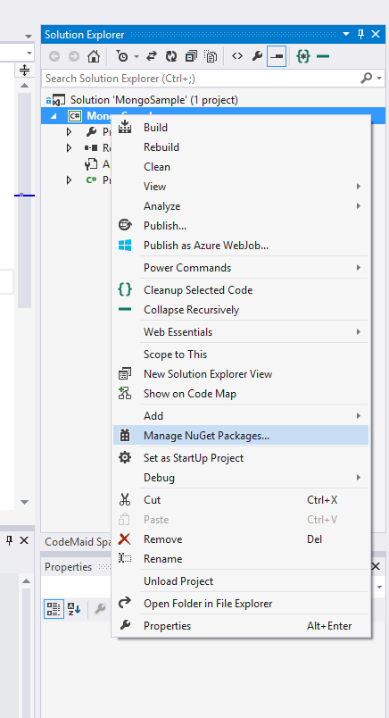
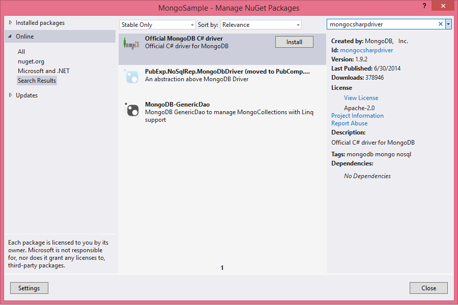
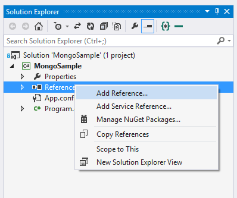
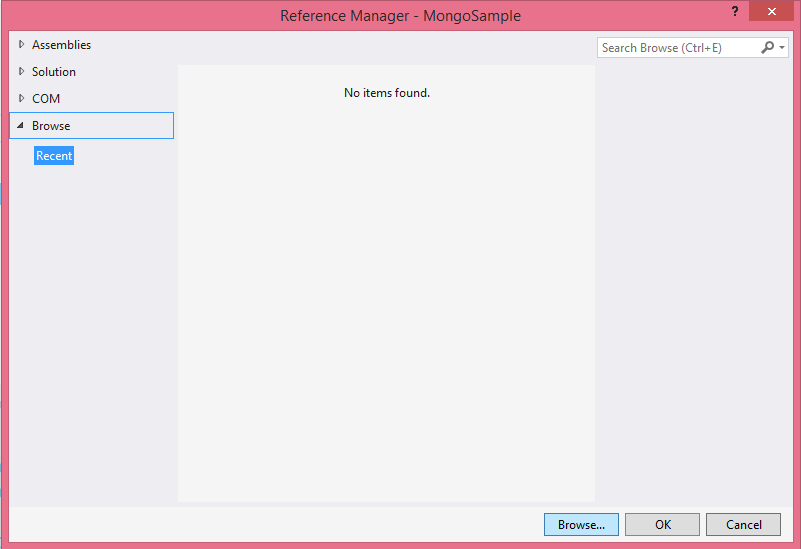
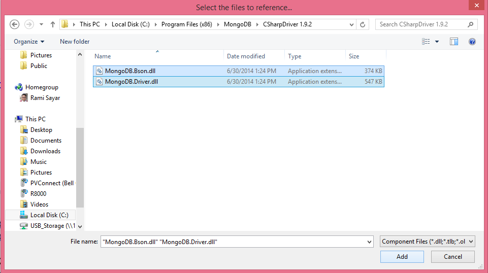

# Module 3: MongoDB Node.js and C# Language Drivers

# Objectives

By the end of this section you will know how to:

- Connect a Node.js and C# application to MongoDB using a language driver
- Perform Create Read Update and Delete (CRUD) operations on a MongoDB collection from Node.js and C#

# Introduction

Every database has language drivers that allow you to interact with the database from a particular programming language. In this module we will use the Node.js and C# language drivers which allow us to do pretty much everything we are able to on the Mongo Interactive Shell but from our application.


# Node.js

## Getting Started

To install the MongoDB driver for Node.js execute the following command in the [Start](./Start) directory of this folder. Ensure you have [node.js installed](http://nodejs.org)

```batch
npm install
```

Because ```package.json``` contains the reference to the mongodb language driver, it gets installed as part of this command.

Now, let's take a look at our starter code within ```app.js```:

```js
// import the language driver
var MongoClient = require('mongodb').MongoClient
  , assert = require('assert');
 var ObjectID = require('mongodb').ObjectID;
  // Connection URL
var url = 'mongodb://127.0.0.1:27017/test';

// Use connect method to connect to the Server
MongoClient.connect(url, function(err, db) {
  
  //ensure we've connected
  assert.equal(null, err);
  

  console.log("Connected correctly to server");


  //close the database connection
  return db.close();

});
```

Running sample above by executing the command:

```batch
node app.js
```

(note: on some systems like Ubuntu the node binary is called 'nodejs'')

The output should indicate a successful connection to your local mongodb server:

```
Connected correctly to server
```

## Inserting a new Document
Now that we can connect to the server lets try inserting a new document into the Person collection. To begin interacting with our Person collection, we'll need to first request the collection reference from the db object.

```js
var bankData = db.collection('bank_data');
```

Then we can start inserting into this collection reference by simply specifying the object to be inserted into the collection:

```

bankData.insert({
  	first_name: "Steven",
  	last_name: "Edouard",
  	accounts: [
  	{
  		account_balance: "50000000",
  		account_type: "Investment",
  		currency: "USD"
  	}]
  }) 

```

Finally because Node.js is completely asynchronous, we'll have to add a callback which will be executed once the insert is completed:

```js

bankData.insert({
  	first_name: "Steven",
  	last_name: "Edouard",
  	accounts: [
  	{
  		account_balance: "50000000",
  		account_type: "Investment",
  		currency: "USD"
  	}]
  }, function(err, result){
  	if(err){
  		return console.error(err);
  	}

  	console.log('inserted: ');
  	console.log(result);
  	return console.log('inserted ' + result.length + ' docs');
  }) 

```

Putting everything together to insert the document to our collection:

```js
// import the language driver
var MongoClient = require('mongodb').MongoClient
  , assert = require('assert');
  // Connection URL for local mongodb server
var url = 'mongodb://127.0.0.1:27017/test';

// Use connect method to connect to the Server
MongoClient.connect(url, function(err, db) {
  
  //ensure we've connected
  assert.equal(null, err);
  
  var bankData = db.collection('bank_data');
  
  //insert new document to bank_data collection
  bankData.insert({
  	first_name: "Steven",
  	last_name: "Edouard",
  	accounts: [
  	{
  		account_balance: "50000000",
  		account_type: "Investment",
  		currency: "USD"
  	}]
  }, function(err, result){
      //callback is executed after mongodb confirms insert
  	if(err){
  		return console.error(err);
  	}

  	console.log('inserted: ');
  	console.log(result);
  	console.log('inserted ' + result.length + ' docs');
  	
	return db.close();

  });
});
```

Running the above code against your database should result in output similar to the following snippet:

```
Connected correctly to server
inserted: 
[ { first_name: 'Steven',
    last_name: 'Edouard',
    accounts: [ [Object] ],
    _id: 5469be33814972ee25b0aa9d } ]
inserted 1 docs
```

## Updating a stored document

We've successfully uploaded a person document, now let's modify the existing document that we've inserted. The above code returns the inserted document upon insert so all we need to to is use the **update** function to update the document in the database.

```js

var updatedPerson = result[0];
//increment this persons balance by 100000
updatedPerson.accounts[0].account_balance += 100000;

bankData.update( { _id: new ObjectID(updatedPerson._id )}, updatedPerson, {w: 1}, function(err, count){
	  	if(err){
  			return console.error(err);
  		}

  		console.log('successfully updated ' + count + ' person documents');

});

```
The callback will receive any error from mongodb and the count of documents that were updated.

The output should look something similar to:

```
sucessfully updated 1 person documents
```
## Reading a stored document

Now that we've successfully inserted and updated a document, let's try retrieving that document. This is very similar to the **find** exercises from module 2 inside the interactive shell. We can query using the node.js driver's **findOne** function to find the document we just inserted. 

FindOne is a convenience function to return the first document from a query - this is useful for queries where you only expect a single document. Let's query by the unique _id field:

```js
//retrieve the inserted collection from mongodb
//should be the exact same object we just updated
	  	
bankData.findOne({_id: new ObjectID(result[0]._id)}, function(err,doc){

	if(err){
		return console.error(err);
	}

	console.log('retrieved Person ' + doc.first_name + ' ' + doc.last_name);
	console.log('accounts: ');
	for(var i in doc.accounts){
		console.log('Type: ' + doc.accounts[i].account_type);
		console.log('Balance: ' + doc.accounts[i].account_balance);
	}
	
	return db.close();
});
```

The fetched single document is returned to the callback and we can pull out any appropriate fields just as a native javascript object. The output of above should be:

```
retrieved Person Steven Edouard
accounts: 
Type: Investment
Balance: 50000000100000
```

### Deleting a Stored Document

Finally, to finish our walkthrough on CRUD operations from Node.js, let's delete the record  we've inserted. We can do this by calling the **remove** function on the collection object.

The drop function takes the same type of query projection object as the **find** and **update** functions.

We'll use the unique **_id** field to delete the exact record we just inserted and updated:

```js
//now delete the document we just inserted

bankData.remove({_id: new ObjectID(result[0]._id)}, function(err,count){
	if(err){
		db.close();
		return console.error(err);
	}

	console.log('sucessfully deleted ' + count + ' documents');

	return db.close();
});
```

The output of this should just be:

```
sucessfully deleted 1 documents
```

## Putting it all together

In the above snippets we've gone through each type of CRUD operation. We've created a new person document, updated that document, read it and then deleted it.

Putting all these pieces together in order requires us to interleave the calls within each callback. In Node.js development there are libraries that implement [promises]() or futures that help make your code more linear looking.

```js
  
  var bankData = db.collection('bank_data');

  bankData.insert({
  	first_name: "Steven",
  	last_name: "Edouard",
  	accounts: [
  	{
  		account_balance: "50000000",
  		account_type: "Investment",
  		currency: "USD"
  	}]
  }, function(err, result){

  	if(err){
  		return console.error(err);
  	}

  	console.log('inserted: ');
  	console.log(result);
  	console.log('inserted ' + result.length + ' docs');

  	var updatedPerson = result[0];
  	updatedPerson.accounts[0].account_balance += 100000;

  	bankData.update( { _id: new ObjectID(result[0]._id )}, updatedPerson, {w: 1}, function(err, count){

  		if(err){
  			return console.error(err);
  		}

  		console.log('sucessfully updated ' + count + ' person documents');

  		//retrieve the inserted collection from mongodb
	  	//should be the exact same object we just updated
	  	
	  	bankData.findOne({_id: new ObjectID(result[0]._id)}, function(err,doc){

	  		if(err){
	  			return console.error(err);
	  		}

	  		console.log('retrieved Person ' + doc.first_name + ' ' + doc.last_name);
	  		console.log('accounts: ');
	  		for(var i in doc.accounts){
	  			console.log('Type: ' + doc.accounts[i].account_type);
	  			console.log('Balance: ' + doc.accounts[i].account_balance);
	  		}

	  		//now delete the document we just inserted

	  		bankData.remove({_id: new ObjectID(result[0]._id)}, function(err,count){

	  			if(err){
	  				db.close();
	  				return console.error(err);
	  			}

	  			console.log('sucessfully deleted ' + count + ' documents');

	  			return db.close();
	  		});

	  		
	  	});
  	});
  	return;
  });
```

Now we'll go through what the functional equivalent of this code looks like in C#.

# C# and .NET

## Getting Started 

To install the MongoDB driver for C#, you have two options: using [NuGet](http://www.nuget.org/packages/mongocsharpdriver/) or the [MSI installer](https://github.com/mongodb/mongo-csharp-driver/releases). You can also use the sample project in [CSharpStart](./CSharpStart) that includes the NuGet package references. 

1. To use the NuGet option, you can right-click on your project file in Visual Studio and press the "Manage NuGet Packages..." item. 



In the Manage NuGet Packages, you can search for "mongocsharpdriver" in the Online packages and press the Install button on the "Official MongoDB C# driver" search result. 



Alternative, you can also execute the following command to install the NuGet package to your project. 

```batch
Install-Package mongocsharpdriver -Version 1.9.2
```

2. To use the MSI installer option, download the [CSharpDriver-1.9.2.msi](https://github.com/mongodb/mongo-csharp-driver/releases/download/v1.9.2/CSharpDriver-1.9.2.msi) installer and follow the instructions. After installation is complete, right-click on your project file in Visual Studio and press "Add Reference..."


In the Reference Manager window, go to the "Browse" tab on the left and press the "Browse..." button on the bottom-right. 



In the file picker window, navigate to "C:\Program Files (x86)\MongoDB\CSharpDriver 1.9.2\" folder (or wherever you installed the SDK to) and select both DLL files in that folder. Press the "Add" button.  



Make sure both MongoDB DLLs are still checked in the Reference Manager and press the "OK" button.



## Connecting to MongoDB

Firstly, let's go into our Program.cs file and add the following references to the top of the file.  

```cs
using MongoDB.Bson;
using MongoDB.Driver;
```

Secondly, let's create a MongoClient and give it a connection URL. MongoClient is thread safe and serves as the root object for working with a MongoDB instance. The connections are handled by the client and are kept in a thread pool, you do not need to call connect or even disconnect.  

```cs
MongoClient client = new MongoClient("mongodb://127.0.0.1:27017/test"); // connect to localhost
```

Thirdly, you have to get an instance of a MongoServer which gives you advanced ways to get a database and guarantee consistence for your operations.  

```cs
MongoServer server = client.GetServer();
MongoDatabase database = server.GetDatabase("test"); // "test" is the name of the database
```

That's all you need to do to connect to MongoDB using the C# driver.

## Inserting a new Document

Now that we can connect to the server lets try inserting a new document into the Person collection. To begin interacting with our Person collection, we'll need to first decide how we want our documents to be represented in our code. 

We have two options to do that; we can use the BsonDocument object or our own data model class. If have not decided how to structure your data and want to take full advantage of Mongo's flexibility, use the BsonDocument object. If you would like a more structured approach to your data or enforce a validation to your documents, you can create your own data model classes.

```cs
MongoCollection<BsonDocument> bankData = database.GetCollection<BsonDocument>("bank_data");
```

We can start inserting into this collection reference by simply specifying the object to be inserted into the collection using the BsonDocument object. You'll also notice that we represent arrays with the BsonArray object.

```cs
BsonDocument person = new BsonDocument {
    { "first_name", "Steven"},
    { "last_name", "Edouard"},
    { "accounts", new BsonArray {
        new BsonDocument {
            { "account_balance", 50000000},
            { "account_type", "Investment"},
            { "currency", "USD"}
        }
    }}
};
bankData.Insert(person);
```

To check if the insert took place correctly, we only need to check that the id of the person has been changed. Notice that we can access any element in our document by using the [] index operator. 

```cs
System.Console.WriteLine(person["_id"]);
```

Putting everything together to insert the document to our collection:

```cs
using MongoDB.Bson;
using MongoDB.Driver;
using System;
using System.Collections.Generic;
using System.Linq;
using System.Text;
using System.Threading.Tasks;

namespace MongoSample
{
	class Program
	{
		static void Main(string[] args)
		{
			MongoClient client = new MongoClient("mongodb://127.0.0.1:27017/test"); // connect to localhost
			MongoServer server = client.GetServer();

			MongoDatabase database = server.GetDatabase("test"); // "test" is the name of the database
			MongoCollection<BsonDocument> bankData = database.GetCollection<BsonDocument>("bank_data");
			BsonDocument person = new BsonDocument {
				{ "first_name", "Steven"},
				{ "last_name", "Edouard"},
				{ "accounts", new BsonArray {
					new BsonDocument {
						{ "account_balance", 50000000},
						{ "account_type", "Investment"},
						{ "currency", "USD"}
					}
				}}
			};
			bankData.Insert(person);
		}
	}
}

```

## Updating a stored document

We've successfully uploaded a person document, now let's modify the existing document that we've inserted. The above code returns the inserted document upon insert so all we need to to is use the update function to update the document in the database.

```cs
//increment this persons balance by 100000
person["accounts"][0]["account_balance"] = person["accounts"][0]["account_balance"].AsInt32 + 100000;
bankData.Save(person);
System.Console.WriteLine("Successfully updated 1 document.");
```

The callback will receive any error from mongodb and the count of documents that were updated.

The output should look something similar to:

```
Successfully updated 1 document.
```

## Reading a stored document

Now that we've successfully inserted and updated a document, let's try retrieving that document. This is very similar to the find exercises from module 2 inside the interactive shell. We can query using the C# driver's FindOne method to find the document we just inserted.

FindOneById is a convenience method to return the first document from a query - this is useful for queries where you only expect a single document. Let's query by the unique _id field:

```cs
//retrieve the inserted collection from mongodb
//should be the exact same object we just updated
BsonDocument newPerson = bankData.FindOneById(person["_id"]);
//check if the account balance was updated.
System.Console.WriteLine(newPerson["accounts"][0]["account_balance"].AsInt32);
```

The fetched single document is returned and we can pull out any appropriate fields just as before. The output of above should be:
```
50100000
```

## Deleting a Stored Document

Finally, to finish our walk through on CRUD operations from C#, let's delete the record we've inserted. We can do this by calling the Remove method on the collection object.

However, the Remove method takes a query parameter of type IMongoQuery. With this query class, we can build or define the attributes/values of the document we are hunting. This is the same query that you can use with the Find() methods to find more than one document or with the Update() method to update more than one document.

You will need add another using statement to be able to use use the Query object. 

```cs
using MongoDB.Driver.Builders;
```

To remove a method we will use the equality query to select a document with the same _id as the newPerson document.

```cs
//now delete the document we just inserted
var query = Query.EQ("_id", newPerson["_id"]);
WriteConcernResult result = bankData.Remove(query);
System.Console.WriteLine("number of documents removed: " + result.DocumentsAffected);
```

The output of this should just be:
```
number of documents removed: 1
```

You can build more complex your queries by using the methods in the Query object. This is an example: 
```cs
var query = Query.And(
    Query.EQ("first_name", "Steven"),
    Query.EQ("last_name", "Edouard")
);
```

## Putting it all together

In the above snippets we've gone through each type of CRUD operation. We've created a new person document, updated that document, read it and then deleted it.

```cs
using MongoDB.Bson;
using MongoDB.Driver;
using MongoDB.Driver.Builders;
using System;
using System.Collections.Generic;
using System.Linq;
using System.Text;
using System.Threading.Tasks;

namespace MongoSample
{
	class Program
	{
		static void Main(string[] args)
		{
			MongoClient client = new MongoClient("mongodb://127.0.0.1:27017/test"); // connect to localhost
			MongoServer server = client.GetServer();

			MongoDatabase database = server.GetDatabase("test"); // "test" is the name of the database
			MongoCollection<BsonDocument> bankData = database.GetCollection<BsonDocument>("bank_data");
			BsonDocument person = new BsonDocument {
				{ "first_name", "Steven"},
				{ "last_name", "Edouard"},
				{ "accounts", new BsonArray {
					new BsonDocument {
						{ "account_balance", 50000000},
						{ "account_type", "Investment"},
						{ "currency", "USD"}
					}
				}}
			};
			bankData.Insert(person);
			System.Console.WriteLine(person["_id"]);

			//increment this persons balance by 100000
			person["accounts"][0]["account_balance"] = person["accounts"][0]["account_balance"].AsInt32 + 100000;
			bankData.Save(person);
			System.Console.WriteLine("Successfully updated 1 document.");

			//retrieve the inserted collection from mongodb
			//should be the exact same object we just updated
			BsonDocument newPerson = bankData.FindOneById(person["_id"]);
			//check if the account balance was updated.
			System.Console.WriteLine(newPerson["accounts"][0]["account_balance"].AsInt32);


			
			//now delete the document we just inserted
			var query = Query.EQ("_id", newPerson["_id"]);
			WriteConcernResult result = bankData.Remove(query);
			System.Console.WriteLine("number of documents removed: " + result.DocumentsAffected);
		}
	}
}
```
