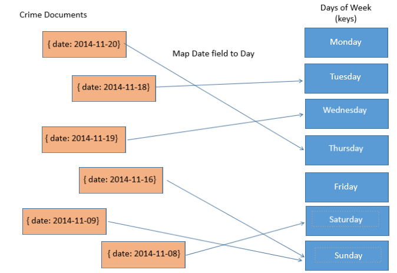
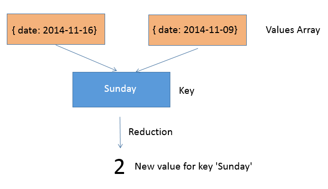
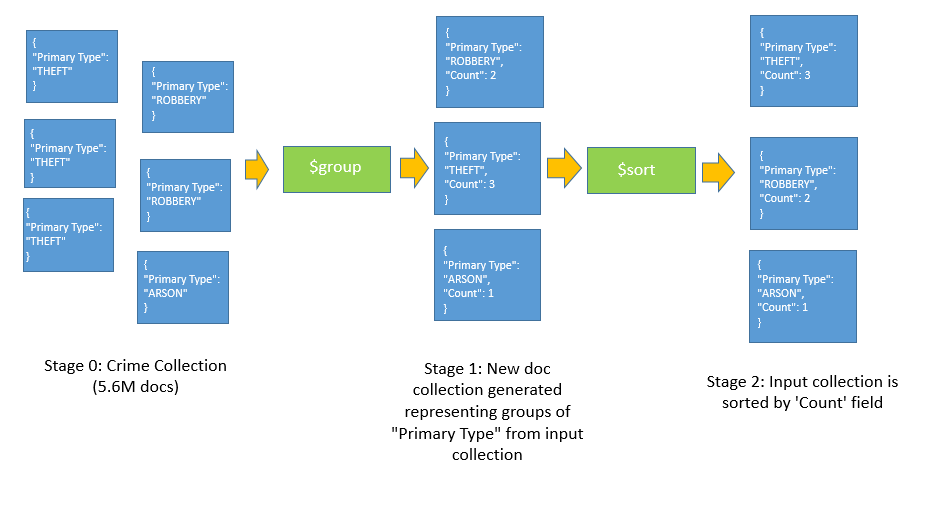

# MongoDB Advanced Data Processing
----------------------

# Objectives

By the end of this module you'll know how:

- Load large csv data sets into MongoDB
- The basics of Map Reduce and Aggregations
- To process data with Map/Reduce tasks in MongoDB against a large collection
- To process data MongoDB Aggregation Tasks

# Introduction

MongoDB provides support for large data processing tasks such as [Map Reduce](http://docs.mongodb.org/manual/core/map-reduce/) and [Aggregation](http://docs.mongodb.org/manual/core/aggregation-pipeline/). Map Reduce is the process of processing your entire database with 2 steps **Map** and **Reduce**.  The Map step maps every document in your database to a category or key. Then in the reduce step, every key reduces all of its mapped values by aggregating all the values with some type of algorithm.

MongoDB aggregation tasks allow similar operations as Map Reduce but works as a pipeline rather than a 2 step process. Aggregations allow you take a collection and transform it N number of times until you get the collection you desire. The advantage to Aggregations vs Map Reduce is that it allows you to only process the parts of your database you need and exclude parts you don't. Map Reduce requires that your *entire* database be processed.

# The Example Data Set

The example data set we will be dealing with is City of Chicago crime police report data from 2001 to 'present' which at the time of writing this is November 2014. The data comes in a large .csv file and we have uploaded a zipped version [here](https://mongdbmva.blob.core.windows.net/csv/crimedata.csv.zip). You can also find the original unzipped download link from the City of Chicago [here](https://data.cityofchicago.org/api/views/ijzp-q8t2/rows.csv?accessType=DOWNLOAD).

After downloading the CSV file, we can import this data to our database using the ```mongoimport``` utility we used previously to import the test bank_data json:

```
mongoimport Crimes_-_2001_to_present.csv --type csv --headerline --collection crimes
```

The ```--type``` parameter specifies its a csv file, ```--headerline``` indicates that the first line of the csv file has the field names and obviously ```--collection``` specifies the collection to insert the new documents into.

Doing this command may take a while and it should be noted that you should do this on a fairly fast machine or else working with data this large may hang up your machine.

Here's what your output will look like:

```
connected to: 127.0.0.1
2014-11-17T21:36:07.025-0800 		Progress: 2756872/1330450848	0%
2014-11-17T21:36:07.026-0800 			11700	3900/second
2014-11-17T21:36:10.004-0800 		Progress: 5634999/1330450848	0%
2014-11-17T21:36:10.004-0800 			23900	3983/second
2014-11-17T21:36:13.013-0800 		Progress: 8629859/1330450848	0%
2014-11-17T21:36:13.013-0800 			36600	4066/second
2014-11-17T21:36:16.003-0800 		Progress: 11551450/1330450848	0%
2014-11-17T21:36:16.003-0800 			49000	4083/second
```

Afterwards you should have about 5.6 million documents uploaded, each representing a police report incident. Here's a sample of what your documents will look like:

```
{ "_id" : ObjectId("5462725476ecd357dbbc721e"), "ID" : 9844675, "Case Number" : "HX494115", "Date" : "11/03/2014 11:51:00 PM", "Block" : "056XX S MORGAN ST", "IUCR" : 486, "Primary Type" : "BATTERY", "Description" : "DOMESTIC BATTERY SIMPLE", "Location Description" : "ALLEY", "Arrest" : "false", "Domestic" : "true", "Beat" : 712, "District" : 7, "Ward" : 16, "Community Area" : 68, "FBI Code" : "08B", "X Coordinate" : 1170654, "Y Coordinate" : 1867165, "Year" : 2014, "Updated On" : "11/10/2014 12:43:02 PM", "Latitude" : 41.790980835, "Longitude" : -87.649786614, "Location" : "(41.790980835, -87.649786614)" }
{ "_id" : ObjectId("5462725476ecd357dbbc721f"), "ID" : 9844669, "Case Number" : "HX494159", "Date" : "11/03/2014 11:50:00 PM", "Block" : "027XX S HOMAN AVE", "IUCR" : 820, "Primary Type" : "THEFT", "Description" : "$500 AND UNDER", "Location Description" : "RESIDENTIAL YARD (FRONT/BACK)", "Arrest" : "false", "Domestic" : "false", "Beat" : 1032, "District" : 10, "Ward" : 22, "Community Area" : 30, "FBI Code" : 6, "X Coordinate" : 1154188, "Y Coordinate" : 1885408, "Year" : 2014, "Updated On" : "11/10/2014 12:43:02 PM", "Latitude" : 41.841385453, "Longitude" : -87.709678617, "Location" : "(41.841385453, -87.709678617)" }
{ "_id" : ObjectId("5462725476ecd357dbbc7220"), "ID" : 9846437, "Case Number" : "HX494607", "Date" : "11/03/2014 11:49:00 PM", "Block" : "008XX N MILWAUKEE AVE", "IUCR" : 4386, "Primary Type" : "OTHER OFFENSE", "Description" : "VIOLATION OF CIVIL NO CONTACT ORDER", "Location Description" : "RESIDENCE", "Arrest" : "false", "Domestic" : "true", "Beat" : 1213, "District" : 12, "Ward" : 27, "Community Area" : 24, "FBI Code" : 26, "X Coordinate" : 1168403, "Y Coordinate" : 1905809, "Year" : 2014, "Updated On" : "11/10/2014 12:43:02 PM", "Latitude" : 41.897072334, "Longitude" : -87.656924505, "Location" : "(41.897072334, -87.656924505)" }
{ "_id" : ObjectId("5462725476ecd357dbbc7221"), "ID" : 9844605, "Case Number" : "HX494099", "Date" : "11/03/2014 11:47:00 PM", "Block" : "025XX W 51ST ST", "IUCR" : 1310, "Primary Type" : "CRIMINAL DAMAGE", "Description" : "TO PROPERTY", "Location Description" : "RESIDENCE", "Arrest" : "true", "Domestic" : "false", "Beat" : 923, "District" : 9, "Ward" : 14, "Community Area" : 63, "FBI Code" : 14, "X Coordinate" : 1159952, "Y Coordinate" : 1870801, "Year" : 2014, "Updated On" : "11/10/2014 12:43:02 PM", "Latitude" : 41.801185293, "Longitude" : -87.688928625, "Location" : "(41.801185293, -87.688928625)" }
```
# Map Reduce Explained

The best way to explain map reduce is to attempt to answer a question about the massive amount of data we have. Let's try this one out for size:

**What day of the week has the most crime incidents recorded in Chicago?**

[Map Reduce](http://en.wikipedia.org/wiki/MapReduce) breaks down this problem into 2 steps, **Map** and **Reduce**.

## Mapping

The question essentially asks us to break down the number of crimes that have occurred from 2001 in Chicago by day. Notice that for each crime document there is a ```Date``` field which indicates the exact date of the incident. We can use this data to **map** the crime document to a specific day of the week. Here's a graphical view of what we will be doing in this step:



Each of the 5.6 million police reports will be processed by mongo db and we will specify that we want the document to be mapped to either the 'Monday', 'Tuesday', 'Wednesday', 'Thursday', 'Friday', 'Saturday', or 'Sunday' keys depending on the date field of the document. We do this by calling the **mapReduce** function on the collection. **mapReduce** takes two functions as parameters, a **map** function and a Reduce function.

The MongoDB driver (and interactive shell) allow us to specify a **map** function which defines how MongoDB will map the documents to their respective keys. To emit a map, the **emit** function can be called within the function to let MongoDB know that you have a mapping for this document.

Here's what this looks like in code using the NodeJS driver (which is very similar to the interactive shell):

```js
//Question: What day of the week do most crimes occur in chicago from September 2001 to present?
crimes.mapReduce(function(){
    
    var milis = Date.parse(this.Date);
    var date = new Date(milis);
    //use a javascript array to create key mappings between 0-6 and Sunday - Saturday
    var daysOfWeek = ["Sunday", "Monday", "Tuesday", "Wednesday", "Thursday", "Friday", "Saturday"];
    //emit the mapping between this document and the Day which it cooresponds to.
    emit(daysOfWeek[date.getDay()], 1);
}
```

Notice that we parse the date field using the Javascript Date class and then use that to easily acquire the day of the week. We then call getDay() to retrieve the day which is a number between 0 and 6. We then use a Javascript array to map those values to a day of the week since every javascript object is already a key/value dictionary.

We can't execute the code snippet above since it's not complete yet without our **reduce** function.

## Reducing

The second step in this process is to reduce the these mappings into a resulting data set which sort of *summarizes* the mappings we've created. The original question at hand would like us to *summarize*  which day of the week crimes happened most frequently in Chicago.

The Map step has already created a large amount of mappings of 5.6 million crime documents to 7 different types of mappings. If we summarized the data by summing the total number of crime documents for each key (the day of the week) we would quickly be able to answer the question at hand.

Here's a Visual representation of what the Reduce step does:



The **reduce** function is the second parameter to the **mapReduce** function where we do this summarization. Reduce is called with 2 parameters, **key** and **values**. 

```js
function(key, values){
    //reduce the set of values to a single sum.
    //the count of values for this day (key) is sufficient enough
    return Array.sum(values);
  },
```
It turns out that the reduce function for this question is quite easy. We just have to return the number of documents that have been mapped to the key (the day of the week).

The final parameter for **mapReduce** is the output collection for the results. This is the collection where the results for each key will be placed. We can pass a simple javascript object that specifies this as an **out** collection:

```js
{
  	out: "crime_day_frequencies"
},
```

Its optional, but let's add a callback function which will output the results upon finishing the map/reduce job. Remember Node.js is asynchronous so the mapReduce function won't stop the application for the task to complete:

```js
function(err, results, stats){
  	console.log('completed!');
  	if(err){
  		return console.err(err);
  	}
	
	var outCollection = db.collection('crime_day_frequencies');

      outCollection.find().toArray(function(err, docs){
        if(err){
          return console.error(err);
        }

        console.log('Number of crimes based on each day of the week');

        for(var i in docs){
          console.log(docs[i]);
        }

        return;
      });
      
 });
```
Putting the entire MapReduce call together for Node.js looks like:

```js
//Question: What day did most crimes occur in chicago from September 2001 to present?
  crimes.mapReduce(function(){
  	
	var milis = Date.parse(this.Date);
	var date = new Date(milis);
  	var daysOfWeek = ["Sunday", "Monday", "Tuesday", "Wednesday", "Thursday", "Friday", "Saturday"];
  	//emit the mapping between this document and the Day which it cooresponds to.
  	emit(daysOfWeek[date.getDay()], 1);
  },
  function(key, values){
      //the values parameter will be an array of docs, since thats the value we emitted in map
  	return values.length;
  },
  {
  	out: "crime_day_frequencies"
  },
  function(err, results, stats){

  	if(err){
  		return console.err(err);
  	}

    var outCollection = db.collection('crime_time_frequencies');

      outCollection.find({}).toArray(function(err, docs){
        if(err){
          return console.error(err);
        }

        console.log('Number of crimes based on each day of the week');

        for(var i in docs){
          console.log(docs[i]);
        }

        return;
      });
  });

```

Finally, the output of this map/reduce job gives us the answer we were looking for in the form of a mongodb collection:

```
Number of crimes based on each day of the week
{ _id: 'Friday', value: 854604 }
{ _id: 'Monday', value: 798881 }
{ _id: 'Saturday', value: 807961 }
{ _id: 'Sunday', value: 760800 }
{ _id: 'Thursday', value: 810790 }
{ _id: 'Tuesday', value: 814967 }
{ _id: 'Wednesday', value: 820651 }
```

From the results above, barring any actual statistical science, it appears that the most common day that crimes have occurred in Chicago since 2001 to present has been Fridays. This could be a very interesting insight!

# Data Aggregations

Another nifty data processing tool that MongoDB offers is [Aggregations](http://docs.mongodb.org/manual/tutorial/aggregation-zip-code-data-set/). Aggregations work on a concept of processing [pipelines](http://docs.mongodb.org/manual/core/aggregation-pipeline/#id1) which consist of a number of stages. At each stage the data in the returned collection of documents is transformed.

As before, the best way to learn this concept is by asking a question about the data and using Aggregations to answer it. Let's go with the question:

**What is the most common type of crime committed in Chicago between 2001 and November 2014?**

Its possible to answer this with Map/Reduce but let's use Aggregates instead. To do aggregates we first start with the original crimes collection of 5.6 million documents, group those documents by the ```Primary Type``` field, keep track of the count for the number of documents in the Primary Type group and then finally sort those groups by the generated count values.

Visually we are processing the crimes collection through a series of pipeline steps:



Stage 0 is the initial collection of Crime elements, which has approximately 5.6 million documents. We then use a [**$group**] (http://docs.mongodb.org/manual/reference/operator/aggregation/group/) operator to group all those documents into groups by ```Primary Type``` which essentially is the type of crime that was committed.

This leaves us with a new collection of documents one for each group, We will add a **count** field to each group to record how many documents are in that group. Finally we do our next pipeline step which is to sort the input collection which is the collection that came out of the $group operator using the **$sort** operator. We will sort descending by the count field on the grouped collection.

Here's what this looks like in Node.js code:

```js
crimes.aggregate({ $group : { _id: "$Primary Type" , count:{$sum: 1} }}, {$sort: { count: -1 } },
  function(err, docs){

    if(err){
      return console.error(err);
    }

    console.log('Crime data by type');
    for(var i in docs){
      console.log(docs[i]);
    }
  }
);
```

For the provided dataset, here are the results, which also yields some interesting insights:

```
{ _id: 'THEFT', count: 1168715 }
{ _id: 'BATTERY', count: 1033129 }
{ _id: 'CRIMINAL DAMAGE', count: 654607 }
{ _id: 'NARCOTICS', count: 646714 }
{ _id: 'OTHER OFFENSE', count: 349060 }
{ _id: 'ASSAULT', count: 343095 }
{ _id: 'BURGLARY', count: 334888 }
{ _id: 'MOTOR VEHICLE THEFT', count: 271217 }
{ _id: 'ROBBERY', count: 212066 }
{ _id: 'DECEPTIVE PRACTICE', count: 186657 }
{ _id: 'CRIMINAL TRESPASS', count: 166819 }
{ _id: 'PROSTITUTION', count: 64586 }
{ _id: 'WEAPONS VIOLATION', count: 53954 }
{ _id: 'PUBLIC PEACE VIOLATION', count: 40761 }
{ _id: 'OFFENSE INVOLVING CHILDREN', count: 35031 }
{ _id: 'SEX OFFENSE', count: 20696 }
{ _id: 'CRIM SEXUAL ASSAULT', count: 20406 }
{ _id: 'GAMBLING', count: 13522 }
{ _id: 'LIQUOR LAW VIOLATION', count: 13063 }
{ _id: 'ARSON', count: 9363 }
{ _id: 'HOMICIDE', count: 6869 }
{ _id: 'INTERFERENCE WITH PUBLIC OFFICER', count: 6738 }
{ _id: 'KIDNAPPING', count: 5936 }
{ _id: 'INTERFERE WITH PUBLIC OFFICER', count: 3760 }
{ _id: 'INTIMIDATION', count: 3379 }
{ _id: 'STALKING', count: 2653 }
{ _id: 'OFFENSES INVOLVING CHILDREN', count: 382 }
{ _id: 'OBSCENITY', count: 294 }
{ _id: 'PUBLIC INDECENCY', count: 114 }
{ _id: 'OTHER NARCOTIC VIOLATION', count: 102 }
{ _id: 'NON-CRIMINAL', count: 24 }
{ _id: 'RITUALISM', count: 23 }
{ _id: 'CONCEALED CARRY LICENSE VIOLATION', count: 14 }
{ _id: 'NON - CRIMINAL', count: 13 }
{ _id: 'NON-CRIMINAL (SUBJECT SPECIFIED)', count: 3 }
{ _id: 'DOMESTIC VIOLENCE', count: 1 }
```

From our results, it would appear that Theft and Battery by far have been the most common types of crimes in Chicago for the past 13 years.

# Aggregates vs Map/Reduce

Map Reduce and Aggregations are very powerful tool sets to gain insights into your MongoDB database. It makes sense to compare and contrast the difference between the two. 

Map Reduce is fundamentally designed to process ALL of your data. Every single document is looked at at least once in a a Map/Reduce task. Map reduce allows for more complex logic in mapping documents to keys. Similarly you can implement more complex behavior for reduction as well. 

Aggregations came to MongoDB after version 2.0 partially out of a need to avoid having to process the entire database if it wasn't needed. Because aggregations use a pipeline model, you can chain as many aggregation operations as you'd like and each subsequent operation can perform better given that the operation before reduced the number of documents.

In short, if the aggregation operators suit your needs and you don't need to process your entire database for each aggregation, than aggregates show a better value. If you constantly process the entire database or have more complex Map or Reduce logic Map/Reduce may be a more attractive option.

# Conclusion

Whether you use Map Reduce or Aggregates you will notice that these tasks take quite some time. Due to this these operations are not designed to be real-time requests and thus should really be ran in the background of your application. Think - hourly, daily or weekly runs where you aggregate some result and do something interesting with that data.

With Map/Reduce and Aggregates you can really find fun and interesting insights without having to write very much code at all.
