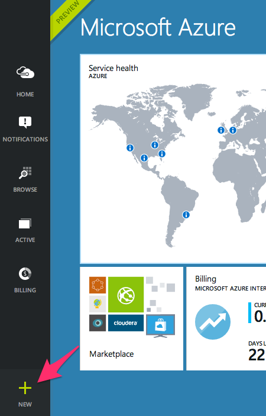
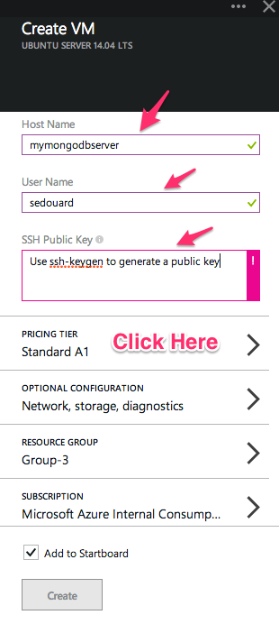
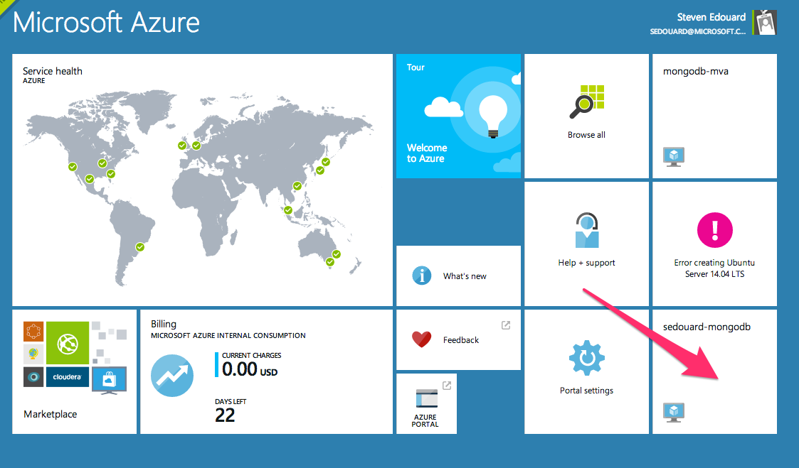
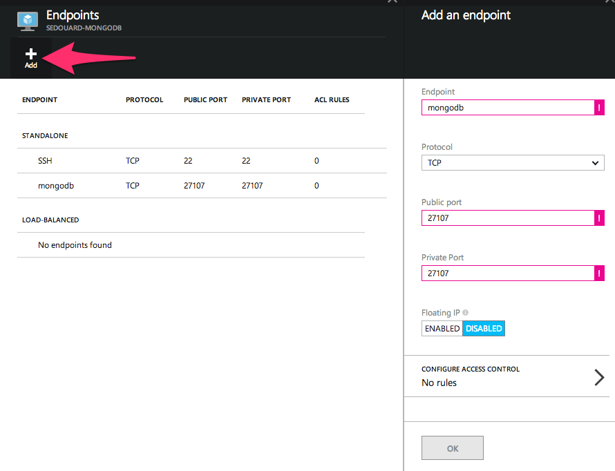

# Running MongoDB on a Cloud Ubuntu VM

# Objective

By the end of this module, you'll know how to:

- Create an Ubuntu Virtual Machine in Azure
- Install MongoDB for Ubuntu
- Configure MongoDB and the Virtual Machine to be accessible by MongoDB clients

# Introduction

Now that we've learned the fundamentals of MongoDB, we're ready to deploy MongoDB in the cloud. To do this, we'll spin up a Solid State Disk (SSD) Virtual Machine Ubuntu instance which will host our MongoDB process. We'll then use [ssh](http://en.wikipedia.org/wiki/Secure_Shell) to connect to the machine to install the database and load the data up.

## Why an SSD Virtual Machine

Solid State Disks are what modern high end laptops ship with. These disks have  a much higher data transfer rate and don't require a mechanical overhead like traditional hard drives. For a database like MongoDB, not all of your database sits in-memory and for  queries that require MongoDB to go to the disk, can take an especially long time if you aren't using an SSD on your machine.

For this reason, it makes the most sense to use an SSD Virtual Machine for a database like MongoDB. You can checkout more information on Azure 'D' series Virtual Machines which use SSDs [here](http://azure.microsoft.com/blog/2014/09/22/new-d-series-virtual-machine-sizes/).

## Why Ubuntu

There are a couple reasons we are using Ubuntu and not a Windows Server instance for this course. Although MongoDB runs on Windows, its also pretty easy to install mongodb Ubuntu linux as well. If you already have spare Windows Virtual Machines or you are restricted to a heterogenous infrastructure of Windows machine it may make more sense to use Windows to host your MongoDB server.

Ubuntu Linux is one of the easiest distributions of Linux to use. When we spin up the server, you just need to SSH into the machine, install mongodb with **apt-get** and use Ubuntu Server's service command to start the database as a local service. So in short, Ubuntu is actually one of quickest and easiest OS's to get an open source project like MongoDB up and running. In addition, Linux virtual machines have a lower monthly cost which could be more attractive to startups looking to use cloud services.

# Creating an Ubuntu Virtual Machine

To create the Virtual Machine, we'll go into the [Azure portal](http://portal.azure.com) and add a new Ubuntu Server virtual machine.

First, click the '+' button on the bottom left side of the portal



Then select the current Ubuntu Server LTS version (LTS means 'Long-term Support')


You'll then presented with the Create VM blade which will require a few inputs. The name of the VM, the user name you'd like to connect with and the SSH public key that you can generate on your local machine with the [ssh-keygen](http://en.wikipedia.org/wiki/Ssh-keygen) command.



Generate your ssh public key by executing the command

```bash
ssh-keygen -f <enter file name to save keys> -P <enter a passphrase> 
```

After this command 2 files will exist, a private key and a public key. Here's an example:

```bash
Users-Computer-4:ssh-keygen-test user$ ssh-keygen -f mongodbserver -P newAzureVM
Generating public/private rsa key pair.
Your identification has been saved in mongodbserver.
Your public key has been saved in mongodbserver.pub.
The key fingerprint is:
5d:e5:aa:13:c7:24:13:c8:cd:0c:74:83:fd:ef:9a:2b user@Users-Computer-4.local
The key's randomart image is:
+--[ RSA 2048]----+
|       ooO+   .  |
|        +.=o o   |
|          o.o .  |
|         . *..   |
|        S o +.   |
|           +  .  |
|          o  .   |
|          E. ..  |
|           .+o   |
+-----------------+
Users-Computer-4:ssh-keygen-test user$ ls
mongodbserver		mongodbserver.pub
Users-Computer-4:ssh-keygen-test user$ 
```

Copy and past the text from the **.pub** file which is your public key to the **SSH Public Key** box on your portal.

**Note:** Windows users, an easy way to get ssh and ssh-keygen on your local machine is to install [Github for Windows](http://windows.github.com) and using their provided 'Git Shell'. This shell has ssh and ssh-keygen binaries installed.

Before you click 'create' you should check out your VM options. For a production deployment its recommend you use a 'D' series virtual machine. If you're just experimenting you can save a lot per month by just picking an Extra Small A0 instance which has no SSD and 1/4th of a core.

Click 'Create' and your Virtual Machine will be ready in a few minutes.

# Connecting to your server via SSH

SSH is the standard way to connect to a Linux/Unix virtual machine. If you need the Graphical User Interface (GUI), its possible to start a VNC server and use a VNC client to get a remote GUI for your Ubuntu server. This walkthrough won't cover that however.

On your local machine connect to your machine by executing the ssh command with your server name, passing your ssh private key for the identity parameter. Your SSH private key is the file generated by ssh-keygen without the extension '.pub'.

```
ssh <yourusername>@<yourservername>.cloudapp.net -i <path to your private key>
```

Once you've successfully logged into your new Ubuntu server you'll see output similar to the following:

```
Welcome to Ubuntu 14.04.1 LTS (GNU/Linux 3.13.0-36-generic x86_64)

 * Documentation:  https://help.ubuntu.com/

  System information as of Tue Nov 18 06:53:49 UTC 2014

  System load:  1.36               Processes:           240
  Usage of /:   47.8% of 28.80GB   Users logged in:     0
  Memory usage: 2%                 IP address for eth0: 10.0.2.4
  Swap usage:   0%

  Graph this data and manage this system at:
    https://landscape.canonical.com/

  Get cloud support with Ubuntu Advantage Cloud Guest:
    http://www.ubuntu.com/business/services/cloud

55 packages can be updated.
30 updates are security updates.


*** System restart required ***
Last login: Tue Nov 18 06:53:51 2014 from 208.66.28.130
```

Ubuntu will tell you a few basic things about your sever upon login.

# Installing MongoDB for Ubuntu

To install MongoDB we can use the debian linux package manager [apt-get](http://linux.die.net/man/8/apt-get) which allows us to easily install software packages for Ubuntu.

Execute the following command to install mongodb and its associated tools to your server:

```bash
# installs the mongodb package key to verify authenticity of package
sudo apt-key adv --keyserver hkp://keyserver.ubuntu.com:80 --recv 7F0CEB10
# creates a mongodb list file
echo 'deb http://downloads-distro.mongodb.org/repo/ubuntu-upstart dist 10gen' | sudo tee /etc/apt/sources.list.d/mongodb.list
# update your package listing to be current
sudo apt-get update
# install the latest version of mongodb
sudo apt-get install -y mongodb-org
```

# Running the MongoDB Server

Before you fire up your database server, configurations have to be made to connect the server to the MongoDB default port 27107 so that your client applications can connect.

First, on the VM level we must open up an endpoint on the machine so that the mongodb server is accessible.

On your azure portal, your Virtual Machine should have ended up on your start board. Click on it's tile:



In the Virtual Machine Blade click the 'Settings' tile and go to the 'Endpoints' dialog:


The Endpoints dialog allows you to add a port for MongoDB. To enter a new endpoint click the big '+' button and enter a new TCP endpoint with port number 27107 and name it 'mongodb':



Finally we must edit the ```/etc/mongo.conf``` file to bind MongoDB to the public 27107 port on the machine. Open up the file with ```vim``` and uncomment this line:

```
sedouard@mongodb-mva:~$ vim /etc/mongod.conf
# Listen to local interface only. Comment out to listen on all interfaces. 
# bind_ip = 127.0.0.1
```

To start the mongodb service you can use the Ubuntu local service manager by executing:

```
# start the mongodb database server
sudo service mongod start
```

# Connecting to your MongoDB Server

## Interactive Shell
To connect to your mongodb server from the mongodb interactive shell just execute the `mongo` command with the server name, port number and database name as a parameter:

```
mongo mongodb-sedouard.cloudapp.net:27107/test
```

## Language Driver

Connecting from a language driver is just as easy. Just use the ```mongodb://``` protocol prefix in your connection string.

```
mongodb://mongodb-sedouard.cloudapp.net:27107/test
```
For example, from Node.js this would be:

```js
// Connection URL
var url = 'mongodb://mongodb-mva-3dc0g242.cloudapp.net:27017/test';
// Use connect method to connect to the Server
MongoClient.connect(url, function(err, db) {

//additional code hidden
```

# Conclusion

Running MongoDB from Virtual Machine is actually pretty easy to do. Just spin up an Ubuntu Virtual Machine, run a couple commands to get MongoDB up and running and just connect to it like its was your local database.

Although its relatively easy to to spin up mongodb servers, you should also be aware of our Partner offerings on the Azure store which runs MongoDB as a service. Those service providers are [MongoDB Inc](http://mongodb.org) and [Mongolabs](http://mongolabs.com). The latter has a free service tier for you to get started with MongoDB without having to deal with the details of updating and scaling MongoDB.

One thing to be aware of however is that if you are using an MSDN subscription from a [Bizspark](http://bizspark.com) or [Bizspark+](http://bizspark.com) member ship, you can't use your Azure credits to pay for these 3rd party services.